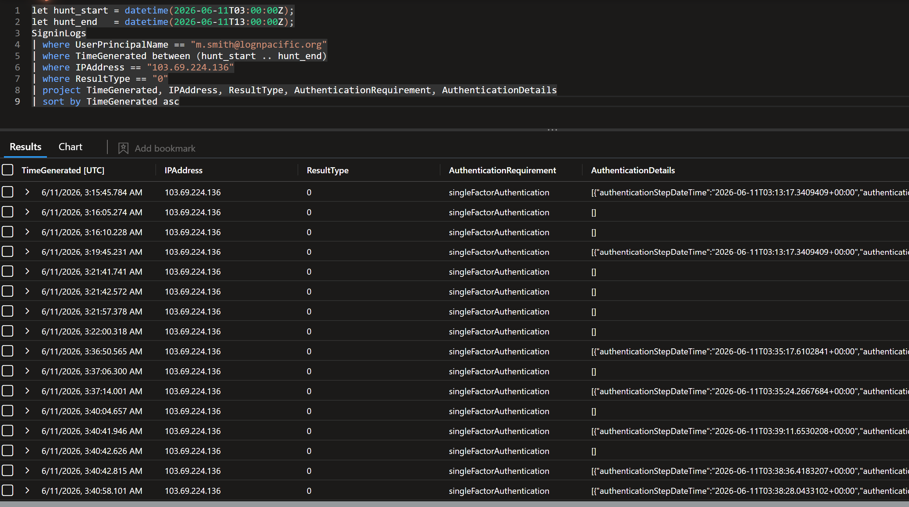

<p align="center">
  
</p>

# 🛡️ Threat Hunt Report – Second Vector
### M365 Identity Compromise — BEC & Silent Exfiltration

---

## 📌 Executive Summary

A Low-severity Entra ID Protection alert on finance user `m.smith@lognpacific.org` proved to be the visible edge of a complete Business Email Compromise. A stolen session cookie was replayed through Outlook Web to bypass MFA, the operator profiled the account via Graph API, planted concealment and forwarding inbox rules, exfiltrated three sensitive files from SharePoint, and ran an internal payment-redirect scam against a colleague — reinforced minutes later on Teams.

A Power Automate flow planted during the session kept forwarding mail to an external Proton address nine hours after the human operator logged off. Conditional Access reported `notApplied` on every successful sign-in; the tenant's MFA policy never engaged on the attacker's traffic.

No malware, no endpoint, no outage. Every action read as routine in isolation. Risk assessment is **Critical** despite the original Low rating.

---

## 🎯 Hunt Objectives

- Validate or refute the original Low-severity Identity Protection verdict on `m.smith`
- Reconstruct the full session from a single flagged sign-in to every downstream action it caused
- Identify how MFA was bypassed and whether tenant policy actually engaged
- Locate any persistence that survives a password reset or session revoke
- Determine what data left the tenant, by what mechanism, and to whom
- Map the activity to MITRE ATT&CK and produce a containment order with no obvious gap

---

## 🧭 Scope & Environment

- **Organisation:** LOG(N) Pacific
- **Platform:** Microsoft 365 / Entra ID (`lognpacific.org`)
- **Tenant ID:** `939e93f3-04f6-479d-82ff-345c231abb4d`
- **Telemetry:** Microsoft Sentinel — workspace `LAW-Cyber-Range`
- **Tables pivoted:** `SigninLogs`, `OfficeActivity`, `CloudAppEvents`, `MicrosoftGraphActivityLogs`, `EmailEvents`, `IdentityLogonEvents`, `BehaviorAnalytics`
- **Investigation window:** 2026-06-11 03:00 UTC → 2026-06-11 13:00 UTC (widened to May 31, 2026 once recon evidence appeared in older mail)
- **Initial source:** Defender XDR incident **87241** — anonymous sign-in on a finance user, rated *Low*

---

## 📚 Table of Contents

- [🧠 Hunt Overview](#-hunt-overview)
- [🧬 MITRE ATT&CK Summary](#-mitre-attck-summary)
- [🔍 Investigation](#-investigation)
  - [Phase 1 — Initial Access: The Replayed Cookie](#phase-1--initial-access-the-replayed-cookie)
  - [Phase 2 — Discovery: Profiling Before Striking](#phase-2--discovery-profiling-before-striking)
  - [Phase 3 — Persistence: Inbox Rules and a Sleeping Flow](#phase-3--persistence-inbox-rules-and-a-sleeping-flow)
  - [Phase 4 — Internal Phish: The Con](#phase-4--internal-phish-the-con)
  - [Phase 5 — Exfiltration: Two Hands on the Files](#phase-5--exfiltration-two-hands-on-the-files)
- [🕒 Attack Timeline](#-attack-timeline)
- [🧾 Indicators of Compromise](#-indicators-of-compromise)
- [🚨 Detection Gaps & Recommendations](#-detection-gaps--recommendations)
- [🧠 Final Assessment](#-final-assessment-1)
- [📎 Analyst Notes](#-analyst-notes)

---

## 🧠 Hunt Overview

The compromise has three rhythms. Reading them in order is what turns a pile of low-severity events into a single coherent intrusion.

**The silent rhythm.** On May 31, `m.smith`'s password was changed and the first connection from the attacker's `/24` appeared within the same hour. This is when the cookie was likely born — the legitimate user authenticated normally through what is, in retrospect, very probably an Adversary-in-the-Middle phishing kit, completing MFA themselves while a reverse proxy harvested the resulting session token. From that point on, the attacker held a key that did not need a password again.

**The human rhythm.** On June 11 between 02:22 and 04:18 UTC, the operator was at the keyboard. Two bad-password attempts via a legacy Office client first, followed by methodical Graph API recon of the account's MFA registration and roles, then a single successful sign-in through OWA at 03:15:45 marked `singleFactorAuthentication`, `Previously satisfied`. Inside that one session: two inbox rules planted (one to conceal replies, one to forward externally), three sensitive files downloaded from SharePoint in a single second, a fraudulent payment-redirect email sent to a colleague, and a Teams message four minutes later reinforcing it. By 04:18 the human was done.

**The robotic rhythm.** At 12:41 PM — nine hours after the active session ended — Power Automate called the Graph `/forward` endpoint against `m.smith`'s mailbox from a Microsoft-owned Azure IP and pushed mail to `merovingian1337@proton.me`. The attacker was gone; their automation was not. A flow created during the active session, granted delegated access through OAuth App `7ab7862c-4c57-491e-8a45-d52a7e023983`, kept executing autonomously.

That third rhythm is why a password reset alone would not close this incident. The OAuth grant on that App ID holds the door open — it survives credential changes and session revocation unless explicitly removed.

Every individual signal here was unremarkable: one anonymous sign-in, an inbox rule, a few SharePoint downloads, a normal-looking internal email. The evidence of intent lives only in the *pattern* — and the pattern only assembles when seven log sources are tied to one session GUID.


---

## 🧬 MITRE ATT&CK Summary

| Phase | Technique | MITRE ID | Priority |
|------|----------|----------|----------|
| Initial Access | Valid Accounts: Cloud Accounts | T1078.004 | Critical |
| Initial Access | Use Alternate Authentication Material: Web Session Cookie | T1550.004 | Critical |
| Command & Control | Proxy | T1090 | High |
| Discovery | Account Discovery: Cloud Account (MFA posture) | T1087.004 | High |
| Discovery | Permission Groups Discovery: Cloud Groups | T1069.003 | Medium |
| Collection | Email Collection: Remote Email Collection (OWA) | T1114.002 | High |
| Initial Access (internal) | Internal Spearphishing | T1534 | Critical |
| Defense Evasion | Hide Artifacts: Email Hiding Rules | T1564.008 | Critical |
| Collection | Data from Cloud Storage (SharePoint) | T1530 | Critical |
| Credential Access | Credentials from Password Stores (pointer file accessed, credential file taken) | T1555 | High |
| Persistence | Event Triggered Execution (Power Automate flow + OAuth grant) | T1546 | Critical |
| Exfiltration | Automated Exfiltration (autonomous Graph `/forward`) | T1020 | Critical |

---

## 🔍 Investigation

The investigation moved phase-by-phase but the evidence did not arrive in that order. The thread that held everything together was the **session GUID** `005d431a-380b-1f5e-e554-16d5010dc28e` — present in `SigninLogs.SessionId` and embedded in `CloudAppEvents.RawEventData`. Once that string was confirmed to appear in both the authentication record and the activity record, every action in this report could be mechanically attributed to one continuous session, not inferred from "same IP, probably same actor."

Each phase below opens with the analytic question that drove it, then walks the evidence, the KQL, the screenshot, and the detection guidance.

---

### Phase 1 — Initial Access: The Replayed Cookie

> **The question driving this phase:** A Low-severity sign-in fired on `m.smith`. Is the verdict right, or is the machine dismissing a full compromise?

#### Finding

A single account, `m.smith@lognpacific.org`, was compromised. **29 successful sign-ins** from `103.69.224.136` (Amsterdam, anonymous proxy, Linux user agent) appeared in the investigation window, and every single one reads `AuthenticationRequirement = singleFactorAuthentication`. On a tenant that enforces MFA, that field is the entire compromise summary in one column.

The mechanism is **token replay**. The `AuthenticationDetails` column on every successful sign-in shows `"authenticationMethod":"Previously satisfied"` — Entra's way of saying *"I'm not asking for MFA again because this session already proved it elsewhere."* A session token does not re-authenticate a person; it just claims a person already did, and Entra trusts the claim. This is **T1550.004 — Use Alternate Authentication Material: Web Session Cookie**. The likely real-world chain is an AiTM phishing kit (Evilginx-style) used around May 31: the victim authenticated normally, the kit captured the resulting session cookie, and the attacker loaded it into their own browser with no further prompts.

Two failed password attempts on June 11 at 02:22 and 02:24 AM — both via the generic `Microsoft Office` app (legacy native-client path, `ResultType 50126`) — landed ~50 minutes before the OWA token replay. The sequence is the attacker's actual logic: try the password first against a legacy endpoint, fail, then commit the stolen cookie against the modern web client where it cannot be challenged.

#### Evidence

| Field | Value |
|------|------|
| Principal | `m.smith@lognpacific.org` |
| Source IP | `103.69.224.136` (Amsterdam, anonymous proxy) |
| Client OS | Linux |
| User agent | `Mozilla/5.0 (X11; Linux x86_64) ... Chrome/149.0.0.0 Safari/537.36` |
| Application | One Outlook Web (`AppId` starting `9199bf20-...`) |
| Authentication requirement | `singleFactorAuthentication` |
| Authentication method | `Previously satisfied` |
| Conditional Access | `notApplied` on all 38 successful sign-ins in the wider corpus |
| Session ID | `005d431a-380b-1f5e-e554-16d5010dc28e` |
| Account status | Enabled |
| Last password change | 2026-05-31 00:53:27 (same hour as first connection from the attacker's `/24`) |


#### KQL — establishing the principal and the source IP

```kql
// Find the flagged sign-in on m.smith and the source IP it came from
SigninLogs
| where TimeGenerated between (datetime(2026-06-11 03:00:00) .. datetime(2026-06-11 13:00:00))
| where UserPrincipalName == "m.smith@lognpacific.org"
| where ResultType == 0
| project TimeGenerated, IPAddress, Location, UserAgent, AppDisplayName,
          AuthenticationRequirement, ConditionalAccessStatus, SessionId
| sort by TimeGenerated asc
```

#### KQL — exposing the token-replay pattern

```kql
// Every successful sign-in from the suspect IP, with the auth requirement and the "Previously satisfied" tell
SigninLogs
| where IPAddress == "103.69.224.136"
| where ResultType == 0
| extend AuthDetails = tostring(AuthenticationDetails)
| project TimeGenerated, UserPrincipalName, AppDisplayName,
          AuthenticationRequirement, AuthDetails, SessionId
| sort by TimeGenerated asc
```

#### KQL — the two bad-password attempts

```kql
// The 50126 failures, ~50 minutes before the token replay, via the legacy Office client
SigninLogs
| where UserPrincipalName == "m.smith@lognpacific.org"
| where ResultType == 50126
| project TimeGenerated, IPAddress, AppDisplayName, ResultDescription, UserAgent
| sort by TimeGenerated asc
```

#### Screenshots

| | |
|---|---|
| Defender XDR attack story |  |
| Entra sign-in logs from the suspect IP |  |
| Account status — Enabled |  |
| `singleFactorAuthentication` on every success |  |
| Bad-password attempts via the legacy Office client |  |
| One Outlook Web — the entry application |  |
| First connection from the attacker's `/24` and the same-hour password change on May 31 |  |

#### Why this matters

A stolen session token is not a key to one room — it is a key to the building. Entra ID's SSO means one replayed token is silently trusted by every app sharing that session. The attacker reached **seven distinct applications** during this single session — OWA, OfficeHome, two SharePoint endpoints, Teams, App Service, and Microsoft Flow Portal — without ever passing another authentication challenge. The one to flag hardest is **Microsoft Flow Portal**: that is Power Automate, the engine for persistence that survives the eventual session revoke (Phase 3).

#### Detection guidance

- **Alert on `AuthenticationRequirement == "singleFactorAuthentication"` combined with `RiskState` non-`none` or `IPAddress` flagged as `anonymizedIPAddress`.** In an MFA-required tenant, single-factor success on a risky sign-in is the literal definition of token replay.
- **Hunt for `Previously satisfied` on AuthenticationMethod with no preceding MFA challenge inside the session window.** A token that claims MFA without ever prompting for it is the AiTM signature.
- **Treat `ConditionalAccessStatus == "notApplied"` as an actionable gap, not as background noise.** If a policy is meant to require MFA and the verdict is `notApplied` on real traffic, the policy does not cover the path the traffic took.


---

### Phase 2 — Discovery: Profiling Before Striking

> **The question driving this phase:** Token replay alone is not the whole story. What did the operator *look at* before committing the cookie? Did they know what they were holding, or did they get lucky?

#### Finding

Between **03:09 and 03:12 AM**, six minutes *before* the successful OWA sign-in at 03:15:45, the attacker made three Graph API calls to the same endpoint:

```
GET /beta/reports/authenticationMethods/userRegistrationDetails
    ?$filter=userPrincipalName eq 'm.smith@lognpacific.org'&isMfaCapable=...
```

That is the canonical Microsoft Graph endpoint for `userRegistrationDetails` — the same one an administrator queries to audit an account's MFA registration posture. Calling it from an end-user context is **T1087.004 — Account Discovery: Cloud Account**.

The chronology turns the call from data into intent. Password guessing had already failed at 02:22–02:24, and the operator did not commit the stolen cookie next — they paused, then ran reconnaissance against the account's auth posture before spending the token. A separate Graph call to `rolemanagement/directory/transitiveRoleAssignments` asked a different question — *is this account privileged?* — equivalent to "am I a Domain Admin yet?"

That next question arrived around 03:45 AM, half an hour into the session, through a different App ID making a Graph call to **`/me/memberOf`** — the canonical endpoint for *what groups does the current user belong to?* This is **T1069.003 — Permission Groups Discovery: Cloud Groups**. The attacker was now looking at the social graph: which finance distribution lists `m.smith` is on, which approvers they routinely email. The output of `/me/memberOf` is precisely the input to BEC target selection.

#### Evidence

| Field | Value |
|------|------|
| MFA-posture endpoint | `/beta/reports/authenticationMethods/userRegistrationDetails` |
| MFA-posture calls | 3 (03:09 – 03:12 AM) |
| Role recon endpoint | `/rolemanagement/directory/transitiveRoleAssignments` |
| Group enumeration endpoint | `/me/memberOf` |
| Group call timestamp | ~03:45 AM (post-login, different AppId) |
| Recon-to-sign-in gap | ~3 minutes (Graph recon ended ~03:12, OWA success at 03:15:45) |

#### KQL — MFA posture reconnaissance

```kql
// userRegistrationDetails calls against m.smith — the MFA-capability question
MicrosoftGraphActivityLogs
| where TimeGenerated between (datetime(2026-06-11 03:00:00) .. datetime(2026-06-11 04:00:00))
| where RequestUri contains "userRegistrationDetails"
| where RequestUri contains "m.smith"
| project TimeGenerated, IPAddress, UserAgent, RequestMethod, RequestUri, ResponseStatusCode
| sort by TimeGenerated asc
```

#### KQL — role and group enumeration

```kql
// Privilege check and social-graph enumeration via Graph
MicrosoftGraphActivityLogs
| where TimeGenerated between (datetime(2026-06-11 03:00:00) .. datetime(2026-06-11 05:00:00))
| where RequestUri has_any ("transitiveRoleAssignments", "/me/memberOf")
| project TimeGenerated, IPAddress, AppId, RequestMethod, RequestUri, ResponseStatusCode
| sort by TimeGenerated asc
```

#### KQL — pinning everything to one session

```kql
// The session GUID appears in SigninLogs.SessionId AND inside CloudAppEvents.RawEventData.
// This is what proves "same actor across all the noise."
let sid = "005d431a-380b-1f5e-e554-16d5010dc28e";
union
    (SigninLogs | where SessionId == sid | extend Source = "SigninLogs"),
    (CloudAppEvents | where RawEventData contains sid | extend Source = "CloudAppEvents")
| project TimeGenerated, Source, ActionType = column_ifexists("ActionType", ""), AppDisplayName, IPAddress
| sort by TimeGenerated asc
```

#### Screenshots

| | |
|---|---|
| Graph calls profiling MFA registration before the login |  |
| Seven distinct apps reached on the same replayed token |  |

#### Why this matters

This is the part of the kill chain that gets dismissed as noise because Graph calls are mostly legitimate by volume. The signal is in the *ordering*: failed-passwords → MFA-posture recon → role recon → token replay → group enumeration → file access → mail send. No defender process that triages each log source in isolation will see this — only cross-table correlation against a single session ID will. The operator behaved like an auditor before they behaved like a thief.

#### Detection guidance

- **Hunt the `userRegistrationDetails` endpoint.** It is rare from end-user IPs and almost always indicates either an admin audit or external recon. Add the suspect IP and the source AppId to any hits; legitimate admin queries will come from corporate egress and trusted apps.
- **Tie `/me/memberOf` calls to risky sign-ins by session ID.** The endpoint is harmless on its own and called constantly by legitimate apps; the value is in the join.
- **Watch the gap between failed legacy auth, MFA-posture queries, and a subsequent OWA success.** That ordering is the AiTM playbook.


---

### Phase 3 — Persistence: Inbox Rules and a Sleeping Flow

> **The question driving this phase:** What does the operator leave behind so the compromise survives them logging off?

#### Finding

The persistence layer is built in two stages, and the second one is the one that matters.

**Stage one — two inbox rules created nine seconds apart on `m.smith`'s mailbox.** Both were created through `OfficeActivity` (`New-InboxRule`) inside the active session, from the attacker's IP:

| Time (UTC) | Rule name | Action | Target |
|---|---|---|---|
| 03:32:22 AM | `Invoice Processing` | `MoveToFolder` | Archive |
| 03:32:31 AM | `Backup Copy` | `ForwardTo` | `merovingian1337@proton.me` |

The naming is the tell. *"Invoice Processing"* is the camouflage — a rule a finance user might plausibly create themselves. Read together, they are a double act: the `Backup Copy` rule pushes a copy of inbound mail externally; the `Invoice Processing` rule moves any reply on the targeted thread into Archive so the victim never sees the conversation. The rule moves rather than deletes — **deletion creates a noticeable gap; an Archive move keeps mail readable by the attacker while making it invisible in the victim's primary view.** That is **T1564.008 — Email Hiding Rules**.

**Stage two — a Power Automate flow.** The session touched `Microsoft Flow Portal` at around 03:28 AM and produced an OAuth grant against App ID `7ab7862c-4c57-491e-8a45-d52a7e023983`. That grant is the durable artifact. Nine hours later, at 12:41:09 PM, the same App ID called the Graph `/me/messages/.../forward` endpoint from Azure IP `20.150.129.194` (Power Automate's service range, not the attacker's residential proxy) and got back HTTP 202. Five seconds later an FW: copy landed in `merovingian1337@proton.me`'s inbox.

This is **T1546 — Event Triggered Execution** at the cloud-identity layer. The persistence is not a registry key or scheduled task — it is a delegated OAuth grant on a single AppId, holding the right to call Graph against this mailbox until something explicitly revokes it. A password reset does not revoke it. Disabling the account does not revoke it. Revoking sign-in sessions does not revoke it. The grant has to be deleted in Entra ID under *Enterprise Applications → AppId `7ab7862c-...` → User consent / permissions → Remove*.


#### Evidence

| Field | Value |
|------|------|
| Rule 1 — name | `Invoice Processing` |
| Rule 1 — action | `MoveToFolder: Archive` |
| Rule 1 — created | 2026-06-11 03:32:22 UTC |
| Rule 2 — name | `Backup Copy` |
| Rule 2 — action | `ForwardTo: merovingian1337@proton.me` |
| Rule 2 — created | 2026-06-11 03:32:31 UTC |
| OAuth AppId (Power Automate persistence) | `7ab7862c-4c57-491e-8a45-d52a7e023983` |
| Flow execution time | 12:41:09 PM (~9 hours after active session ended) |
| Flow execution IP | `20.150.129.194` (Microsoft Azure / Power Automate range) |
| Graph endpoint called | `POST /me/messages/{id}/forward` |
| Graph response | `HTTP 202 Accepted` |

#### KQL — surfacing the rule creations

```kql
// Inbox rules created during the session — naming, target, and creator IP
OfficeActivity
| where TimeGenerated between (datetime(2026-06-11 03:00:00) .. datetime(2026-06-11 05:00:00))
| where Operation in ("New-InboxRule", "Set-InboxRule")
| where UserId == "m.smith@lognpacific.org"
| project TimeGenerated, ClientIP, Operation, OfficeObjectId, Parameters
| sort by TimeGenerated asc
```

#### KQL — finding the Power Automate persistence

```kql
// Graph forward calls made by the rogue AppId, not by the attacker IP
MicrosoftGraphActivityLogs
| where TimeGenerated between (datetime(2026-06-11 03:00:00) .. datetime(2026-06-11 13:00:00))
| where AppId == "7ab7862c-4c57-491e-8a45-d52a7e023983"
| where RequestUri contains "/forward" or RequestUri contains "/sendMail"
| project TimeGenerated, IPAddress, RequestMethod, RequestUri, ResponseStatusCode
| sort by TimeGenerated asc
```

#### KQL — anchoring the flow back to the active session

```kql
// Same session GUID, plus any reference to "Flow" or "Power Automate" in the session events
let sid = "005d431a-380b-1f5e-e554-16d5010dc28e";
CloudAppEvents
| where TimeGenerated between (datetime(2026-06-11 03:00:00) .. datetime(2026-06-11 05:00:00))
| where RawEventData contains sid
| where RawEventData has_any ("Flow", "Power Automate", "ProcessSimple")
| project TimeGenerated, ActionType, AccountObjectId, IPAddress, RawEventData
| sort by TimeGenerated asc
```

#### Screenshots

| | |
|---|---|
| Both inbox rules created on the mailbox |  |
| Cross-table sweep of the attacker IP — every log source that saw it |  |

#### Why this matters

The two-stage persistence reframes this from "session hijack" to "persistent compromise." The rules can be deleted from a single Outlook session by `m.smith` herself. The Power Automate flow cannot. Until the OAuth grant is explicitly removed:

- The flow fires regardless of any password reset on `m.smith`.
- The flow keeps firing even if the user account is disabled — the App holds delegated permissions that were granted, not borrowed.
- The flow's runtime IP is Microsoft's own Azure infrastructure, so *no IP block on `103.69.224.136` reaches it.* The attacker's outbound proxy is irrelevant once the flow is in place.

This is why containment order matters. Only revoking the OAuth grant on the App ID — followed by revoking active sign-in sessions — actually closes the channel.

#### Detection guidance

- **Alert on every `New-InboxRule` that contains a `ForwardTo` or `RedirectTo` action targeting an external domain.** The rule's name is irrelevant; the action is the signal. Most legitimate forwarding rules forward inside the tenant.
- **Alert on `New-InboxRule` that moves mail to Archive, Deleted Items, or RSS Feeds when the rule conditions specify a sender or subject.** Generic archive rules are common; targeted ones with a sender/subject filter are concealment.
- **Hunt OAuth grants per user.** Run a weekly query against `AuditLogs` for `Consent to application` operations and surface any non-Microsoft, non-corporate AppIds against users in finance, HR, or executive groups. The asymmetry here is brutal: an attacker only needs the grant to happen once; defenders need to notice it.
- **Watch Graph activity from Microsoft-owned Azure IP ranges against single mailboxes.** Power Automate's egress is a known range; activity from it against a single user with no obvious business automation context is worth surfacing.


---

### Phase 4 — Internal Phish: The Con

> **The question driving this phase:** What is the operator actually trying to *do* with the access — and who else gets pulled into the fraud?

#### Finding

At **04:13:54 AM UTC**, an email left `m.smith`'s mailbox from the attacker's session IP `103.69.224.136`. Subject: **`Updated Banking Details - Pacific IT Monthly`**. Recipient: `j.reynolds@lognpacific.org` — a colleague in the finance approval loop. This is **T1534 — Internal Spearphishing**, executed from the legitimate compromised mailbox: not a spoof, not a lookalike domain, not an SPF/DKIM failure. The email is real, sent by `m.smith`'s real account, with `m.smith`'s real signature and history.

The pretext was not improvised. Four minutes before the email went out, the attacker mined an older thread inside `m.smith`'s mailbox titled **`Q1 Vendor Payment Schedule - Review Required`** — a five-message exchange from February 8 between `m.smith`, a colleague called *josh*, and `j.reynolds`. The fraudulent message reads as the next legitimate step in an existing conversation, not a cold ask. Classic BEC playbook: read first, write second.

**Four minutes later, at 04:17:56 AM**, a second message hit the same target on a second channel — Microsoft Teams `MessageSent` from the same session. Same theme: reinforce the payment update, encourage `j.reynolds` to act before the next payroll cycle. Two channels increases perceived legitimacy and creates social pressure to respond fast.

One detail buried in the mail evidence is bigger than this phase: **`merovingian1337@proton.me`** — the exfiltration address — appears in `EmailEvents` as having corresponded with `m.smith` **four months before the intrusion**, on February 8 ("Updated Invoice - Meridian Consulting Q1 2026"). Either a vendor relationship whose trust got abused, or evidence the operator had eyes on this mailbox's orbit months before the active compromise. Worth a dedicated follow-up.

#### Evidence

| Field | Value |
|------|------|
| Fraudulent email — sent | 2026-06-11 04:13:54 UTC |
| Fraudulent email — sender | `m.smith@lognpacific.org` (compromised, not spoofed) |
| Fraudulent email — recipient | `j.reynolds@lognpacific.org` |
| Fraudulent email — subject | `Updated Banking Details - Pacific IT Monthly` |
| SenderIPv4 on outbound mail | `103.69.224.136` |
| Mined thread (pretext source) | `Q1 Vendor Payment Schedule - Review Required` (5 messages, Feb 8) |
| Teams reinforcement — sent | 2026-06-11 04:17:56 UTC (~4 min after the email) |
| Teams reinforcement — channel | Microsoft Teams Web Client (`MessageSent`) |
| Pre-existing contact in mailbox | `merovingian1337@proton.me` (Feb 8, "Updated Invoice - Meridian Consulting Q1 2026") |

#### KQL — finding the outbound BEC email

```kql
// Outbound mail from m.smith on the suspect IP during the active session
EmailEvents
| where TimeGenerated between (datetime(2026-06-11 04:00:00) .. datetime(2026-06-11 05:00:00))
| where SenderFromAddress == "m.smith@lognpacific.org"
| where SenderIPv4 == "103.69.224.136"
| project TimeGenerated, Subject, RecipientEmailAddress, SenderIPv4, DeliveryAction
| sort by TimeGenerated asc
```

#### KQL — the Teams reinforcement message

```kql
// Same session, four minutes later, reinforcing the email on a second channel
CloudAppEvents
| where TimeGenerated between (datetime(2026-06-11 04:00:00) .. datetime(2026-06-11 05:00:00))
| where Application == "Microsoft Teams"
| where ActionType == "MessageSent"
| where AccountObjectId has "m.smith" or RawEventData contains "m.smith"
| project TimeGenerated, ActionType, AccountDisplayName, IPAddress, RawEventData
| sort by TimeGenerated asc
```

#### KQL — surfacing the pretext thread the attacker read first

```kql
// The Feb 8 thread that the new email leans against; widen the lookback because pretext mining reaches into older mail
EmailEvents
| where TimeGenerated between (datetime(2026-02-01) .. datetime(2026-02-15))
| where Subject has "Q1 Vendor Payment Schedule"
| where SenderFromAddress in ("m.smith@lognpacific.org", "j.reynolds@lognpacific.org") or RecipientEmailAddress in ("m.smith@lognpacific.org", "j.reynolds@lognpacific.org")
| project TimeGenerated, Subject, SenderFromAddress, RecipientEmailAddress
| sort by TimeGenerated asc
```

#### Screenshot

| | |
|---|---|
| Email + Teams reinforcement + the later FW: to merovingian1337 |  |

#### Why this matters

This phase is the *purpose* of the entire intrusion. Everything before it — the cookie theft, the recon, the rules, the flow — exists to make this one email arrive in `j.reynolds`'s inbox looking exactly like the routine continuation of an existing finance workflow, with no defender alert firing on the way in. The fraud is not the email itself; it is the *system* that ensures no other message about this topic reaches either inbox for the rest of the day. Rules archive the reply, the flow forwards the evidence externally, the Teams message creates urgency.

#### Detection guidance

- **Internal mail from a recently-flagged sign-in session is the BEC primitive.** Build a correlation between `IdentityInfo` risk state, `SigninLogs.SessionId`, and `EmailEvents.SenderIPv4` so that an outbound message from a risky session against an internal recipient becomes a single alert. None of the three signals will catch this alone.
- **Multi-channel reinforcement is a BEC signature.** An email from `m.smith` to `j.reynolds` followed by a Teams message from `m.smith` to `j.reynolds` inside five minutes is rare enough to alert. Both messages individually are routine.
- **Treat any reply suppression by inbox rules as a BEC indicator regardless of the rule's name.** The rule's existence is the signal, not its label.


---

### Phase 5 — Exfiltration: Two Hands on the Files

> **The question driving this phase:** What actually left the tenant, by what mechanism, and is there evidence the operator was deliberate about which files they took?

#### Finding

Two distinct exfiltration mechanisms operated against this tenant, separated by nine hours and run from completely different IP addresses. They are operationally the same crime and forensically the same compromise, but they require different containment.

**Hand one — manual SharePoint downloads.** At approximately **03:37 AM UTC**, inside the active session, three files moved from "accessible in the cloud" to "in attacker hands":

| File | Path | Purpose |
|---|---|---|
| `VPN-Access-Credentials.txt` | `/Documents/IT-Credentials/` | Enables future direct access — VPN creds for re-entry |
| `Vendor-Banking-Details.txt` | `/Documents/Finance/` | The reference sheet that makes the fraud email credible |
| `Book.xlsx` | `/Documents/` | Almost certainly a contacts list, payment schedule, or financial register |

The distinction matters: every other file action in this session shows up as `FileAccessed/View`, `FileModified/Edit`, or `FileModifiedExtended/Edit` — all happen *inside* SharePoint, content stays in the tenant. `FileDownloaded/Download` is categorically different: it produces a copy that leaves SharePoint's boundary entirely. **This is the moment files moved from "still ours" to "no longer ours."** The MITRE technique is **T1530 — Data from Cloud Storage**.

Three files, downloaded in the same second, hand-picked: one for re-entry, one for the active fraud, one as bulk reference. That is a curated pull, not a smash-and-grab. A different file — `yomark.pdf` — was opened with `FileAccessed/View` but never downloaded, which fits a pointer file pattern (a document pointing to a credential store, not the credentials themselves), inside **T1555 — Credentials from Password Stores**.

**Hand two — autonomous Power Automate forwarding.** Nine hours after the human session ended, the persistence laid in Phase 3 produced its first runtime artifact:

```
12:35:14 PM UTC  →  MicrosoftGraphActivityLogs: first of ~53 mail-related API calls
                    from AppId 7ab7862c-4c57-491e-8a45-d52a7e023983 (Power Automate)
                    on Azure IP 20.150.129.194
12:41:09 PM UTC  →  Graph POST /me/messages/{id}/forward → HTTP 202 Accepted
12:41:14 PM UTC  →  EmailEvents: FW: copy delivered to merovingian1337@proton.me
                    via Exchange Online relay 20.190.190.224
```

Six minutes of Graph activity before the EmailEvents record even exists. **The attacker's IP, `103.69.224.136`, is completely absent from every record in this phase.** `20.150.129.194` is Microsoft Azure's Power Automate range; `20.190.190.224` is Exchange Online's relay. No human, no attacker keyboard — just Microsoft's own infrastructure executing the planted automation. The technique is **T1020 — Automated Exfiltration**.

This is the loop the entire intrusion was built to close: an attacker signs in at 03:15, sets up the flow at 03:28, leaves at 04:18 — and Microsoft's own automation continues to push every new piece of mail to a Proton address for as long as the OAuth grant exists.


#### Evidence

| Field | Value |
|------|------|
| Manual download — when | 2026-06-11 03:37 UTC (3 files within 1 second) |
| Manual download — source IP | `103.69.224.136` (attacker session) |
| Manual download — mechanism | SharePoint `FileDownloaded/Download` |
| Pointer file accessed (not downloaded) | `/Documents/yomark.pdf` (`FileAccessed/View`) |
| Autonomous forward — first Graph call | 12:35:14 PM UTC |
| Autonomous forward — Graph forward call | 12:41:09 PM UTC, `POST /me/messages/{id}/forward`, `HTTP 202` |
| Autonomous forward — mail delivered | 12:41:14 PM UTC |
| Autonomous forward — AppId | `7ab7862c-4c57-491e-8a45-d52a7e023983` (Power Automate) |
| Autonomous forward — execution IP | `20.150.129.194` (Microsoft Azure / Power Automate) |
| Autonomous forward — mail relay | `20.190.190.224` (Exchange Online) |
| Autonomous forward — destination | `merovingian1337@proton.me` |
| Log table the forward lives in | `MicrosoftGraphActivityLogs` (the *cause*) → `EmailEvents` (the *effect*) |

#### KQL — the three file downloads

```kql
// FileDownloaded events on m.smith's mailbox during the active session — what actually left SharePoint
CloudAppEvents
| where TimeGenerated between (datetime(2026-06-11 03:00:00) .. datetime(2026-06-11 05:00:00))
| where ActionType == "FileDownloaded"
| where AccountObjectId has "m.smith" or RawEventData contains "m.smith"
| project TimeGenerated, ActionType, ObjectName = column_ifexists("ObjectName", ""), IPAddress, RawEventData
| sort by TimeGenerated asc
```

#### KQL — separating reads from downloads

```kql
// The categorical distinction: in-place activity vs activity that produces a copy off-tenant
CloudAppEvents
| where TimeGenerated between (datetime(2026-06-11 03:00:00) .. datetime(2026-06-11 05:00:00))
| where ActionType in ("FileAccessed", "FileModified", "FileModifiedExtended", "FileDownloaded")
| where RawEventData contains "m.smith"
| summarize FileCount = count() by ActionType
| sort by FileCount desc
```

#### KQL — the autonomous Graph forward call

```kql
// The flow firing 9 hours later, from Microsoft's own infrastructure, with no attacker IP anywhere
MicrosoftGraphActivityLogs
| where TimeGenerated between (datetime(2026-06-11 12:00:00) .. datetime(2026-06-11 13:00:00))
| where AppId == "7ab7862c-4c57-491e-8a45-d52a7e023983"
| where RequestUri has_any ("/forward", "/sendMail")
| project TimeGenerated, IPAddress, RequestMethod, RequestUri, ResponseStatusCode, UserId
| sort by TimeGenerated asc
```

#### KQL — proving cause precedes effect

```kql
// Graph activity from the rogue AppId first, EmailEvents record afterwards — 6-min gap
let graphCalls =
    MicrosoftGraphActivityLogs
    | where TimeGenerated between (datetime(2026-06-11 12:00:00) .. datetime(2026-06-11 13:00:00))
    | where AppId == "7ab7862c-4c57-491e-8a45-d52a7e023983"
    | project TimeGenerated, Source = "MicrosoftGraphActivityLogs", Detail = RequestUri;
let mailEvents =
    EmailEvents
    | where TimeGenerated between (datetime(2026-06-11 12:30:00) .. datetime(2026-06-11 13:00:00))
    | where RecipientEmailAddress contains "merovingian1337"
    | project TimeGenerated, Source = "EmailEvents", Detail = Subject;
union graphCalls, mailEvents
| sort by TimeGenerated asc
```

#### Screenshot

| | |
|---|---|
| The three SharePoint downloads in the active session |  |

#### Why this matters

The exfiltration phase closes the case file in two layers. The first answers *what was taken* — credentials, a vendor banking sheet, and a workbook of likely financial reference data. The second answers *how the channel keeps producing more* — Power Automate firing autonomously, from infrastructure that does not appear on any blocklist of the attacker's IP. Even if every file taken at 03:37 were already cleaned and rotated, the flow keeps producing copies of every new piece of mail until the OAuth grant is removed.

This is also where the "no malware, no endpoint" framing gets its sharpest illustration. The exfiltration is built from native Microsoft services, executed by Microsoft's own automation, delivered through Microsoft's own mail relay. Every component is benign in isolation. The compromise is the *configuration* — two rules and one flow, planted in twelve minutes by a session that should not have existed.

#### Detection guidance

- **Treat `FileDownloaded` clusters from anonymized IPs as the highest-priority signal in cloud-storage telemetry.** Three downloads in one second from a Linux UA on an anonymous proxy is a near-perfect curated exfil signature.
- **Differentiate `FileAccessed` (read in place, stays in tenant) from `FileDownloaded` (copy off-tenant) in every cloud-storage detection rule.** Many rules conflate the two and produce false positives on routine viewing.
- **Hunt for Graph `/forward` or `/sendMail` calls made by non-Microsoft AppIds against finance mailboxes.** Build the detection around the AppId, not the user — the user is no longer the actor at this point.
- **When a Power Automate flow forwards mail, the cause lives in `MicrosoftGraphActivityLogs` and the effect lives in `EmailEvents`. Detection rules that look only at `EmailEvents` will see the forward arrive but miss the automation that produced it.** The Graph table is where the rogue AppId becomes visible.


---

## 🕒 Attack Timeline

The compromise spans 11 days from the cookie-theft window through the autonomous exfiltration. Read it once top-to-bottom — the three rhythms (silent, human, robotic) are visible in the spacing.

| Time (UTC) | Phase | Event |
|---|---|---|
| 2026-05-31 00:53:27 | Silent | `m.smith` password change — same hour as the first connection from the attacker's `/24` |
| 2026-05-31 | Silent | First risk event from `103.69.224.32` (same /24, recon) — likely the AiTM moment |
| 2026-06-11 02:22 | Human | Bad password attempt #1 via legacy `Microsoft Office` client (`ResultType 50126`) |
| 2026-06-11 02:24 | Human | Bad password attempt #2 — same vector, same result |
| 2026-06-11 03:09–03:12 | Human | 3× Graph calls to `/userRegistrationDetails` on `m.smith` (MFA-posture recon) |
| 2026-06-11 03:09–03:12 | Human | Graph call to `/rolemanagement/directory/transitiveRoleAssignments` (privilege check) |
| 2026-06-11 03:13 | Human | First `CloudAppEvents` activity tied to the session GUID |
| 2026-06-11 03:15:45 | Human | First successful OWA sign-in — `singleFactorAuthentication`, `Previously satisfied` |
| 2026-06-11 03:28 | Human | Activity in `Microsoft Flow Portal` — flow created |
| 2026-06-11 03:32:22 | Human | Inbox rule `Invoice Processing` created (MoveToFolder → Archive) |
| 2026-06-11 03:32:31 | Human | Inbox rule `Backup Copy` created (ForwardTo → `merovingian1337@proton.me`) |
| 2026-06-11 03:35–03:42 | Human | SharePoint browsing — `yomark.pdf` accessed (pointer file, no download) |
| 2026-06-11 03:37 | Human | 3× `FileDownloaded` (VPN creds, vendor banking, `Book.xlsx`) — all in one second |
| 2026-06-11 03:45 | Human | Graph call to `/me/memberOf` (social-graph enumeration, different AppId) |
| 2026-06-11 04:13:54 | Human | Fraudulent email to `j.reynolds` — *Updated Banking Details - Pacific IT Monthly* |
| 2026-06-11 04:17:56 | Human | Teams `MessageSent` to `j.reynolds` — 4-min reinforcement |
| 2026-06-11 ~04:18 | Human | Active session ends |
| 2026-06-11 12:35:14 | Robotic | Power Automate fires — first of ~53 Graph calls from AppId `7ab7862c-...` on Azure IP `20.150.129.194` |
| 2026-06-11 12:41:09 | Robotic | Graph `POST /me/messages/.../forward` — HTTP 202 |
| 2026-06-11 12:41:14 | Robotic | FW: mail delivered to `merovingian1337@proton.me` via Exchange Online relay `20.190.190.224` |

---

## 🧾 Indicators of Compromise

### Network indicators

| Type | Indicator | Context |
|---|---|---|
| IP | `103.69.224.136` | Attacker session — Amsterdam, anonymous proxy, Linux UA |
| IP | `103.69.224.32` | Same `/24` — first observed May 31, likely AiTM recon source |
| IP | `20.150.129.194` | Power Automate flow execution — Microsoft Azure range |
| IP | `20.190.190.224` | Exchange Online relay delivering the autonomous forward |
| Email | `merovingian1337@proton.me` | Exfiltration destination — also corresponded with `m.smith` on Feb 8 (pre-intrusion contact, worth investigating) |
| User agent | `Mozilla/5.0 (X11; Linux x86_64) ... Chrome/149.0.0.0 Safari/537.36` | Attacker browser fingerprint |

### Identity / session indicators

| Type | Indicator | Context |
|---|---|---|
| Principal | `m.smith@lognpacific.org` | Compromised finance user |
| Session GUID | `005d431a-380b-1f5e-e554-16d5010dc28e` | The string that ties `SigninLogs` and `CloudAppEvents` together |
| OAuth AppId | `7ab7862c-4c57-491e-8a45-d52a7e023983` | Power Automate persistence — **must be revoked in Enterprise Applications** |
| Tenant ID | `939e93f3-04f6-479d-82ff-345c231abb4d` | LOG(N) Pacific |

### File indicators

| File | Path | Action |
|---|---|---|
| `VPN-Access-Credentials.txt` | `/Documents/IT-Credentials/` | Downloaded — rotate creds |
| `Vendor-Banking-Details.txt` | `/Documents/Finance/` | Downloaded — assume exposed |
| `Book.xlsx` | `/Documents/` | Downloaded — review contents, treat as exposed |
| `yomark.pdf` | `/Documents/` | Accessed (not downloaded) — review as a possible credential-store pointer |

### Mailbox-rule indicators

| Rule name | Action | Notes |
|---|---|---|
| `Invoice Processing` | MoveToFolder → Archive | Concealment — suppresses replies to the fraud thread |
| `Backup Copy` | ForwardTo → `merovingian1337@proton.me` | Exfiltration — must be deleted via Exchange admin |


---

## 🚨 Detection Gaps & Recommendations

### Observed gaps

- **`ConditionalAccessStatus = notApplied` on every successful sign-in in this incident.** The tenant's MFA policy never engaged on the attacker's traffic. The token-replay path used a legacy authentication route that the existing Conditional Access policies did not cover. This is the largest single control failure of the incident.
- **Anonymous IP sign-ins rated *Low* and auto-dismissed.** 7 of 8 risk events on this principal in the wider corpus were dismissed by the platform's own logic. A finance user signing in from an anonymous proxy with no MFA prompt should never close at *Low* automatically.
- **Inbox-rule creation is not alerting on this tenant.** Two rules created nine seconds apart, one forwarding to an external Proton address, produced no alert at the time.
- **OAuth grants to non-Microsoft AppIds are not surfaced.** The grant on `7ab7862c-...` against a finance user happened inside a single session and was never reviewed.
- **Cross-table correlation by session GUID is not built into existing detections.** Every signal here was visible in isolation; the compromise was visible only after a manual join across seven tables.
- **The `Microsoft Office` legacy app surface remains reachable.** Bad-password attempts via the generic `Microsoft Office` AppId succeeded in producing `ResultType 50126` records — that path is still live for password spraying.

### Recommendations — containment order (do this in sequence)

1. **Revoke `m.smith`'s active sign-in sessions** in Entra ID (`Revoke sessions`). This kills the cookie. Do this *first* — a password reset alone leaves active tokens valid for their remaining lifetime.
2. **Reset `m.smith`'s password and force re-registration of MFA methods.** Audit registered methods against what the user expects to be there.
3. **Revoke the OAuth grant on AppId `7ab7862c-4c57-491e-8a45-d52a7e023983`** in *Enterprise Applications → that AppId → User consent / permissions → Remove*. Until this is done, the flow keeps firing regardless of session revocation or password reset.
4. **Delete the Power Automate flow** in `admin.powerplatform.microsoft.com` for the affected tenant. The OAuth revoke makes the flow non-functional; deletion makes it gone.
5. **Delete the two inbox rules** (`Invoice Processing` and `Backup Copy`) on `m.smith`'s mailbox via Exchange admin or PowerShell `Remove-InboxRule`.
6. **Rotate every credential present in the downloaded files.** Treat the VPN credentials in `VPN-Access-Credentials.txt` and any account references in `Vendor-Banking-Details.txt` and `Book.xlsx` as compromised.
7. **Notify `j.reynolds` directly via an out-of-band channel.** The Teams reinforcement message and the rule-archived reply mean the victim may not yet know the request was fraudulent. Do not rely on email to deliver this notification.
8. **Mailbox audit:** review every sent item from `m.smith` between June 11 03:15 and 04:18 UTC for any additional fraudulent outbound mail beyond the one identified.
9. **Investigate `merovingian1337@proton.me` as a pre-existing contact**, not only as an exfil endpoint. The Feb 8 thread suggests prior contact with this mailbox that pre-dates the active intrusion.

### Recommendations — detection engineering

- **Build a single-session correlation rule.** Surface any session whose `SignInLogs.SessionId` is observed making subsequent activity in `CloudAppEvents` (file ops), `OfficeActivity` (rule creation), `EmailEvents` (outbound mail), and `MicrosoftGraphActivityLogs` (Graph calls) within the same session window — and alert when that session also fires a risk event. The technique here was only visible in the join.
- **Alert on inbox rules with external `ForwardTo` or `RedirectTo`.** No exceptions; this is one of the highest-precision detections available in M365 and the false-positive rate is low.
- **Alert on `New-InboxRule` paired with `MoveToFolder` to `Archive`, `Deleted Items`, or `RSS Feeds` when the rule has a sender or subject filter.**
- **Build a daily OAuth-grant review** for users in finance, HR, and exec groups. Surface any new grant to a non-Microsoft, non-corporate AppId for human review within 24 hours.
- **Detect `singleFactorAuthentication` on sign-ins where Conditional Access reports `notApplied`** — this combination is the AiTM signature on an MFA-required tenant.
- **Alert on Graph `/forward` or `/sendMail` from a non-Microsoft AppId** against a single mailbox more than 5 times in a 24-hour window.
- **Surface `/userRegistrationDetails` calls from end-user contexts.** Most legitimate queries to this endpoint come from administrator tooling on trusted egress.

### Recommendations — policy

- **Close the legacy authentication path.** Block legacy auth via Conditional Access — the bad-password attempts in this incident landed on `Microsoft Office` (the generic legacy app identifier), which is exactly the surface that should not be available to anonymous proxies.
- **Require phishing-resistant MFA (FIDO2 / Windows Hello) for finance and approver roles**, and block token-only auth for those principals.
- **Treat `AuthenticationRequirement = singleFactorAuthentication` as a Conditional Access trigger, not as background metadata.** Sign-ins reporting `Previously satisfied` from anonymized IPs should require fresh interactive MFA, not session inheritance.


---

## 🧠 Final Assessment

The original night-shift verdict — *Low severity, dismissed* — was wrong. The compromise scored Low because every individual signal scored Low: one anonymous sign-in, one inbox rule, a handful of SharePoint downloads, an internal email between colleagues. There is no signal here that, looked at alone, demands escalation. The compromise lives entirely in the *pattern*, and the pattern only exists once seven log sources are bound to one session GUID.

**On attacker sophistication.** The operator is deliberate, not opportunistic. They paused for ~45 minutes between failed password attempts and committing the stolen cookie, used that pause to run Graph-API reconnaissance against the account's MFA posture, mined an existing four-month-old vendor thread for pretext before sending the fraud email, planted concealment and forwarding in two rules created nine seconds apart, and built a Power Automate flow that survives every credential-level remediation. Token replay paired with same-mailbox pretext mining paired with Power Automate persistence is the BEC tradecraft of an operator who has done this before.

**On defensive posture.** The tenant has the telemetry to reconstruct this attack — every record needed for this report was present in Sentinel. What it does not yet have is the analytic surface to surface the attack in real time. The single most impactful change is correlation by session GUID across `SigninLogs`, `CloudAppEvents`, `OfficeActivity`, `EmailEvents`, and `MicrosoftGraphActivityLogs`. The second most impactful change is OAuth-grant review for finance, HR, and exec users.

**On risk rating.** The compromise is **Critical**, not Low. Three sensitive files left the tenant. A BEC was executed against an internal colleague with social-pressure reinforcement on a second channel. The exfiltration mechanism continues to run autonomously until an OAuth grant is explicitly revoked. Breach-notification obligations should be assessed in the next 24 hours.

---

## 📎 Analyst Notes

- **Investigation pivot ladder:** `Defender XDR Incident 87241` → `SigninLogs` (principal, IP, auth requirement) → `MicrosoftGraphActivityLogs` (pre-login recon) → `CloudAppEvents` (session activity by GUID) → `OfficeActivity` (rule creation) → `EmailEvents` (BEC outbound and autonomous forward) → back to `MicrosoftGraphActivityLogs` (rogue AppId firing the forward).
- **The session GUID is the spine.** Every claim in this report can be re-derived from the single string `005d431a-380b-1f5e-e554-16d5010dc28e`.
- **`AuthenticationDetails` is the highest-signal column in `SigninLogs` for this class of attack.** The `Previously satisfied` value is the literal telemetry of token replay.
- **`ConditionalAccessStatus = notApplied` is not the same as "no policy required MFA."** It means the policy exists but did not cover the path the traffic took. That is a control gap, not a benign outcome.
- **The Graph `/forward` call is the cause; the `EmailEvents` `FW:` record is the effect.** Detection rules that watch only the mail table see the effect and miss the cause.
- **Power Automate persistence cannot be remediated without removing the OAuth grant.** Disabling the user, resetting the password, and revoking sessions are necessary but not sufficient.
- **The Feb 8 `merovingian1337@proton.me` contact in the mailbox pre-dates the active intrusion** and is the strongest single lead for prior reconnaissance or insider-adjacent activity. Worth a dedicated follow-up.
- **Total log sources required to make this case:** seven — `BehaviorAnalytics`, `CloudAppEvents`, `EmailEvents`, `IdentityLogonEvents`, `MicrosoftGraphActivityLogs`, `OfficeActivity`, `SigninLogs`. `AuditLogs` returned zero relevant records, which is itself a detection-coverage observation.

---

*Hunt 04 — Second Vector · Log(n) Pacific · LAW-Cyber-Range · 2026 · Analyst: Károly Mathe*

[[Second Vector Brief]] 
